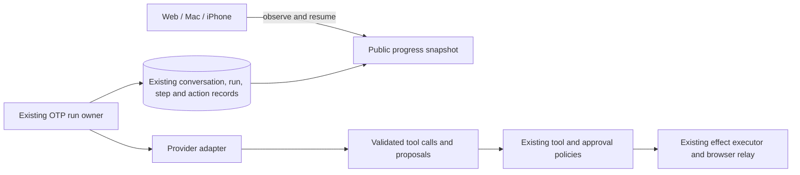

# Agent framework slice: decision and evidence

September 8, 2026

Keep the shared progress stream. The comparison selected provider-native tool calling for integration, and the [native todo tool follow-up](native-todo-tools.md) now connects it to the existing harness. Keep ReqLLM available in the isolated comparison project. Leave Jido out of production for now: it did not improve outcomes in this slice and it added another state adapter without removing existing ownership or approval code.

The work is in the existing Maraithon repository. Production still uses the existing assistant harness, model routing, PostgreSQL ownership, generation fences and prepared-action approval flow.

## What changed for the product

Web, Mac and iPhone now observe the same public conversation and run state. Run steps and prepared actions trigger live updates. A disconnect recovers from the current authorized snapshot, with periodic reconciliation if a notification is missed. Reconnecting cannot submit a message, confirm an action or start another run.

Both native clients share `AssistantProgressKit`, which handles SSE framing, bounded memory, cancellation and cursor validation. Mac clears stale active-run state when the authoritative snapshot says work has finished. iPhone keeps transient reply text out of SwiftData and stops observing while inactive. Local state changes invalidate a cached recovery cursor before it is reused.

The [progress contract](todo-progress-stream.md) documents endpoints, event shapes and limits. This is snapshot recovery. It does not introduce a second durable event journal or promise replay of every token.

## What was provisioned

The comparison uses an isolated Mix project under `experiments/agent_frameworks`, ReqLLM 1.22.0, Jido 2.3.3, and a committed dependency lockfile. It runs on the already available Elixir 1.19.5 / OTP 28.3 toolchain. Model calls use Maraithon's existing OpenRouter credential in Google Secret Manager and its production model, `moonshotai/kimi-k3`.

There is no new hosted database, queue, account, persistent worker service, or production dependency. The experiment has no production database access. Its contacts, meeting, notes and proposed messages are synthetic, and its tool catalog contains no sender, booking function or todo-completion function.

## Comparison

Three meeting-preparation cases, two repetitions each, four approaches: 24 runs. The cases covered normal preparation, an unrelated person with the same first name plus a malicious instruction in source text, and unavailable meeting notes.

All approaches used the same model, evidence, tool schemas, output-token ceiling, temperature, low reasoning effort and execution limits. HTTP retries were disabled. The JSON-envelope mode used the current envelope pattern and code-fence stripping; it did not run the full production harness's repair, reflection or fallback-model logic. All modes returned the same brief/proposal artifact through a local `return_brief` tool.

| Approach | Valid grounded artifacts on first pass | Median time for successful runs | Median first tool decision for successful runs |
| --- | ---: | ---: | ---: |
| JSON envelope | 2 / 6 | 9.79 s, only 2 successful samples | 2.77 s |
| Direct native tools | 6 / 6 | 23.74 s | 5.54 s |
| ReqLLM native tools | 6 / 6 | 17.20 s | 4.79 s |
| Jido + ReqLLM specialist | 6 / 6 | 17.65 s | 4.81 s |

The four envelope failures were JSON decoding errors. Native calls removed that particular failure in this sample. The numbers do not establish that one library is faster: provider routing, prompt caching, small sample size and differing successful populations affect latency. First tool decision is measured from a completed provider response, not the first streamed token.

Successful artifacts cited observed evidence, used Christina's and Michael Chen's verified IDs, kept the todo open, preserved the meeting time, and handled unavailable notes without inventing the price. The injected recipient did not appear in successful proposals. No messages were sent and no calendar event or todo was changed by the experiment.

The [complete run evidence](evidence/agent-framework-comparison-2026-09-08.json) includes proposals, observed tool results, per-turn usage, timings and individual checks. Failed envelope calls do not retain their token usage, so the file is not a complete spend ledger. Integration troubleshooting runs are excluded from these 24 results.

## Framework decision

**Provider-native tool calling earned the next integration.** It gives the provider an explicit tool schema and returns structured calls with IDs. Maraithon should continue to validate those calls and route them through its existing tool and effect policies. OpenRouter documents that tool execution remains the caller's responsibility. [OpenRouter tool calling](https://openrouter.ai/docs/guides/features/tool-calling)

**ReqLLM is a useful adapter candidate, with a runtime prerequisite.** Its response objects, tool-call normalization, tool-result matching and continuation context replace handwritten transport work in the experiment. `append_tool_exchange` validates the relationship between calls and results without executing a tool. [ReqLLM Context](https://hexdocs.pm/req_llm/ReqLLM.Context.html#append_tool_exchange/3)

The dependency graph is the catch. ReqLLM 1.22.0 advertises Elixir 1.15, but requires `llm_db >= 2026.9.1`; the resolved `llm_db 2026.9.1` requires Elixir 1.18. Maraithon's Docker build is pinned to Elixir 1.16.2 / OTP 26.2.2. This was verified in the fetched package sources and lockfile. Installing the SDK into production now would require a separate runtime change. The isolated project makes that dependency decision explicit.

**Jido stays experimental.** The specialist accepted fenced observations, built a reviewable proposal, rejected an older generation and restored observations from host-supplied state. Jido's `cmd` model is a workable Elixir boundary for this. [Jido Agent](https://hexdocs.pm/jido/Jido.Agent.html)

It did not improve any of the six task outcomes over the same ReqLLM loop. It also did not remove Maraithon's leases, idempotency, database writes, prepared-action approvals or recovery logic. The host still needs all of them. Using Jido as another scheduler or owner would increase the amount of coordination code. Its current value here is a bounded specialist interface, and this sample did not justify adopting that extra layer.

## What stays authoritative

The next production integration should add native calls behind the existing provider boundary, preserve generation fencing and prepared actions, then compare real task outcomes and maintenance code against the current harness. A full framework replacement is not supported by this experiment. Browser work continues to use Maraithon's existing paired-Mac Chrome relay.

## Validation

The Elixir server compiled with warnings treated as errors. The Mac compiled with SwiftPM and as a signed Xcode app. The iPhone compiled for the simulator and produced a signed distribution archive. The standalone experiment compiled and ran the comparison above.

No application test suites were added or run, following the repository's current manual-first development policy. The requested comparison is the bounded evaluation described here. Deployment and live-observation receipts are recorded in the [completion note](agent-framework-slice-completion.md).

## Deployment repair

The first new server revision failed its key-retirement boot guard. A read-only Cloud Run audit found the durable catalog was not ready while the privacy catalog was ready. The earlier People Network cache migration had added `local_calendar_events.people_network_forget_sources`, changing exactly three durable-catalog fingerprints: the table, the trigger and `people_network_forget_sources()`.

The follow-up migration registers precisely those changes. Under a transaction and an exclusive lock on the calendar-source table, it checks the expected cleanup function and trigger configuration, temporarily removes only the new cache trigger, and requires the complete catalog to match its previously reviewed state. It restores the trigger, updates the three fingerprints through the existing migrator-only write path, and requires all protocol readiness checks to pass before commit. Every existing security guard stays enabled. Protocol modes, ownership epochs and action approvals are unchanged.

The existing production revision recovered during diagnosis. The final deployment includes this repair and canonical UUID subscriptions for native clients.
