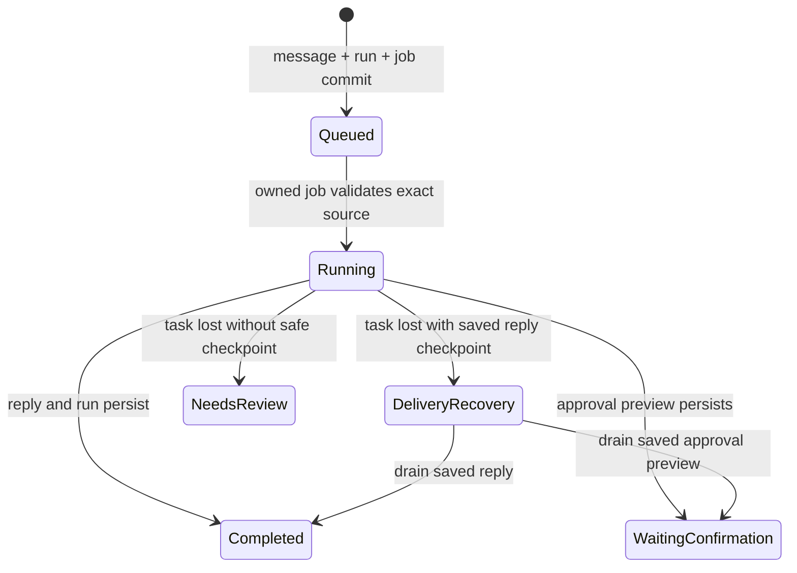

# Durable todo conversations

September 8, 2026

An accepted message needs to survive the web request and the process that handles it. This slice puts web, Mac and iPhone conversations under Maraithon's existing durable OTP job runtime. The provider-native tool adapter stays in place. No new agent framework, queue service or database is needed.

For example, Kent can ask about Christina's availability, then add a second instruction about Michael. Each message now has its own saved run receipt. A reconnect returns the receipt for that exact message. Recovery no longer guesses from nearby timestamps.

## Acceptance and ownership

One database transaction locks the user privacy fence and conversation, then saves the queued run, user turn, conversation metadata and background job. Failure rolls back all four. The turn's existing `assistant_run_id` records the relationship; the encrypted, bound job payload names the run, conversation and turn explicitly. This uses existing schema and payload protections.

Concurrent submissions with the same client message ID return the original run. Reusing that ID with different text returns a conflict. There is a limit of 50 queued or running mobile-surface requests per user. Duplicates remain readable at the limit. Model routing runs outside the acceptance transaction.

The job uses `runtime_model_user`, existing tenant fairness and the model rate limit. A conversation execution partition serializes its messages across nodes while allowing other conversations and background review to progress within the tenant's existing concurrency allowance. An earlier queued or running request takes precedence, including when it is waiting for a retry. Three attempts bound execution retries.

The local thread Registry, DynamicSupervisor and long-lived GenServers are removed. Compatibility enqueue callers now publish durable jobs. There is no process for every idle todo or conversation.

## Recovery boundaries

The job handler validates the user, conversation, source turn and run together. It claims a queued run under the current PostgreSQL task authority. Run creation, run updates, completion and final turn persistence inside that execution recheck the task lease and job claim in their write transaction. Provider calls happen outside those transactions. The existing job runtime owns physical task termination and outcome settlement.

A delivery retry can only drain a saved standard-reply or todo-digest checkpoint. It cannot fall through into a new model/tool loop if the checkpoint disappears. Saved delivery from a model-escalation child run can also settle its accepted parent run. Local reply identities prevent duplicate conversation turns.

A lost task without a safe delivery checkpoint becomes degraded with an explicit instruction to review saved actions. An action may have happened before its receipt was committed. Automatically repeating that loop would be unsafe. This slice does not implement resumable intermediate model or tool execution, or exactly-once external effects.

The minute recovery sweep remains a bounded backstop. It leaves pending, running and termination-pending jobs to their owner. Older queued rows without an exact source relationship fail visibly instead of guessing. The legacy Telegram reaper no longer also reaps mobile-surface runs. Prepared-action approvals and browser relay semantics remain the authority for external actions.

The durable progress stream already reads the same conversation and run records, so all three clients receive these changes without a native rebuild. Fast deterministic commands now use the owned job lane too, which adds queue latency but makes acceptance and restart behaviour consistent.

## Storage verification cache

Exact-protocol verification remains positive-only with a five-minute TTL. Activation still verifies storage uncached.

Cache invalidation now changes a generation. A proof that finishes after invalidation must run again before it can return or enter the cache. Two retries bound this race; repeated invalidation fails closed. A short publication lock prevents different proof keys from overwriting each other's entries. Verification itself does not hold that publication lock. The cache retains at most 32 fresh entries. No failures are cached.

This fixes a correctness race and avoids lost cache entries. It does not establish a database performance improvement. The earlier 34% verification figure was cumulative statement history, not a measurement of this release's steady-state cost.

## Verification and remaining work

The server compiles with warnings treated as errors. Application test suites were not added or run under the current manual-first policy. Deployment and live request receipts are appended below after verification.

The next continuation boundary is intermediate tool receipts: distinguish completed read-only work, prepared artifacts, confirmed external writes and unknown outcomes before allowing a model loop to resume. ReqLLM remains an adapter candidate after a deliberate production Elixir upgrade. Jido remains experimental until a specialist improves task outcomes or removes meaningful maintenance code.

## Production delivery

Commit `00e039cf` deployed as `maraithon-00283-zs9`, serving 100% of traffic. Cloud Build `bdec07c1-9771-44c4-b70f-009ff0d808b7` succeeded. No migration or native rebuild was required. The changes are also synced into `~/bliss/maraithon`, preserving unrelated edits.

In a separate private conversation, two arithmetic requests returned HTTP 202 with distinct run IDs. Retrying the first returned its original ID; changing its body while reusing that ID returned HTTP 409. Both requests then completed in order with one correct reply each. They waited about 40 seconds during the post-deploy partition handoff. A subsequent model-backed request completed with one reply as well.

The new revision subsequently reported 64 owned and admitting partitions, zero unready partitions and one Agent lease. The snapshot also reported two open tasks and two unproven tasks; it is not a complete runtime health audit. The [delivery evidence](evidence/durable-todo-conversations-2026-09-08.json) records the HTTP responses and runtime snapshot.

These live checks do not exercise crashes, cache races or external action replay. No messages were sent to other people, and the verification requests did not invoke action tools.

The read-only Cloud Run execution `maraithon-todo-validation-82g4r` confirmed three completed jobs, each with one settled task assignment and durable outcome evidence. Each job names the matching user turn and run. No job retry was needed. The Michael and Christina meeting todo remained open, working, owned by You, at workflow revision 4.
