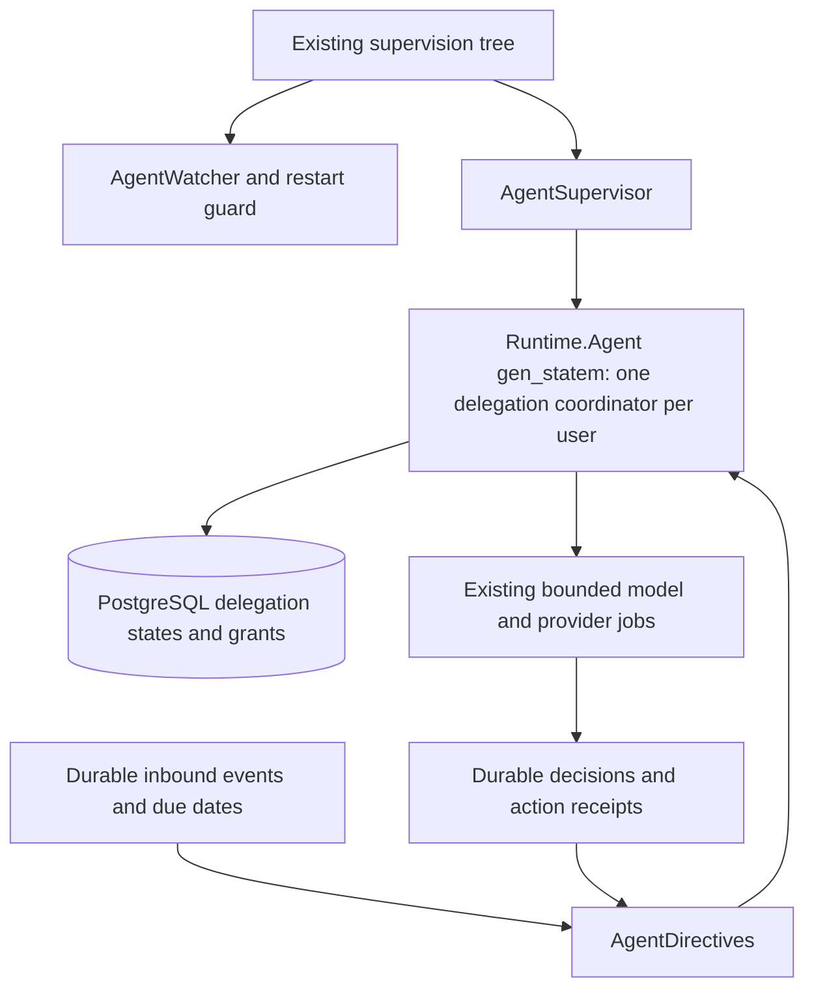
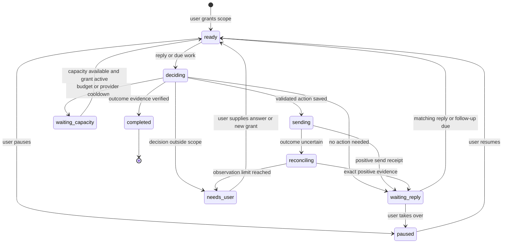

# Delegated email and Slack conversations

Architecture spike and implementation plan. September 14, 2026.

Source baseline: `12edccd16ea1aec1ef6959ec8ddf1e9dc49e75e4`.
Status: proposed. This spike inspected code and provider documentation. It did not run a delegated conversation, send messages, change production, or measure the proposed feature's cost.

## Recommendation

Build delegation as a durable workflow attached to a todo. The user gives Maraithon an outcome and permission to pursue it. Maraithon sends the first message, waits for a reply, responds within that permission, follows up when needed, and stops when the outcome is proven or it needs the user's decision.

Use the existing Erlang/OTP `gen_statem` Agent runtime, PostgreSQL ownership protocol, background jobs, model execution, voice memory, and prepared actions. Add explicit conversation authority and durable reply routing. A delegation can remain open for months, including months without a reply. Its lifetime is independent of any process, lease, model run, login session, or deployment.

Keep one supervised delegation coordinator per user on the existing Agent runtime. Each conversation has its own durable state machine in PostgreSQL. The coordinator handles small transition requests and dispatches bounded work. Waiting consumes records and a future wake time, with no running model or sleeping worker. The app can shut down completely and resume those conversations from stored facts.

The main work is deciding when Maraithon still has permission to act and proving what happened after a send. Gmail already has a useful recovery path. Slack needs that path built and verified. Both need a conversation lifecycle that outlives a chat request.

### The experience we're building

An illustrative delegation:

> Get the delivery date from this supplier by Friday. Use my work email. You can answer questions using this order and follow up twice. Ask me before accepting a price or delivery change.

Maraithon sends an email in the user's voice. The supplier asks for the order number. Maraithon answers from the supplied order. The supplier confirms a date. Maraithon records the date with the supplier's message as evidence, closes the delegated outcome, and updates the user. The user did not approve each message.

The same workflow must work in a Slack thread using the connected user's identity. A successful first send followed by a notification asking the user to write every reply does not satisfy this feature.

Start with text conversations about status, coordination, and collecting information. A delegation can authorise specific commitments when its limits are explicit. The first release does not execute payments, change contracts, upload files, run browser actions, or create meetings. Those require separate capabilities later. Supplying an already approved link or answering from an authorised source is supported.

## What exists today

These findings come from the code at the baseline above. Historical verification reports are useful context, but do not establish that the proposed behaviour works today.

| Area | Current implementation | What delegation needs |
| --- | --- | --- |
| Task ownership | [Workflow](../lib/maraithon/todos/workflow.ex) distinguishes the user from another person. Tracking preserves that person's ownership. [ActionHandoff](../lib/maraithon/todos/action_handoff.ex) applies a planned transition after a successful action, with a todo revision check. | Keep the accountable person separate from who executes a follow-up. A Charlie-owned task stays Charlie-owned. Merely being copied or affected does not authorise sending. |
| Shared chat runtime | [AssistantChat.Execution](../lib/maraithon/assistant_chat/execution.ex) runs web, Mac, and iPhone requests through `runtime_model_user`, with assignment fencing and saved continuations. Its entry point requires a bound user turn. [Run](../lib/maraithon/telegram_assistant/run.ex) currently supports `telegram` and `mobile` surfaces. | Add a real delegation trigger and binding. Do not fabricate user messages to wake this runtime or treat an inbound supplier message as a user instruction. |
| OTP lifecycle | [Runtime.Agent](../lib/maraithon/runtime/agent.ex) is an existing `gen_statem`, started through [AgentSupervisor](../lib/maraithon/runtime/agent_supervisor.ex) and monitored by [AgentWatcher](../lib/maraithon/runtime/agent_watcher.ex). [Behavior](../lib/maraithon/behaviors/behavior.ex) supports versioned snapshot migration and absolute wake times. Agent directives currently cap delay at seven days; active Agents poll directives every five seconds. | Use one coordinator per user rather than multiplying idle polling by conversation count. Keep months-away dates in business rows and materialise due directives within the supported horizon. Add strict restore validation for automated sends. |
| Individual actions | [PreparedAction](../lib/maraithon/telegram_assistant/prepared_action.ex) persists encrypted payloads. [TelegramAssistant](../lib/maraithon/telegram_assistant.ex) freezes the payload and claims execution after confirmation. | Add a distinct authorisation path referencing the user's delegation grant. Preserve individual confirmation for actions outside delegation. |
| Gmail sends | [GmailSendMessage](../lib/maraithon/tools/gmail_send_message.ex) uses OAuth and supports reply and message identities. [ActionReconciliation](../lib/maraithon/telegram_assistant/action_reconciliation.ex) observes uncertain Gmail sends using a frozen Message-ID and account. | Reuse those send and recovery guarantees for each conversation turn. Add stricter thread, recipient, and grant binding. |
| Slack sends | [SlackPostMessage](../lib/maraithon/tools/slack_post_message.ex) requests a user token and `chat:write`. The connector sends channel, text, and optional `thread_ts`. `slack_post` is absent from reconciliation's supported action types. | Add frozen send identity, positive reconciliation, and provider error classification before unattended Slack writes. |
| Account selection | [SlackHelpers](../lib/maraithon/tools/slack_helpers.ex) prioritises a supplied Slack user ID but retains other user-token candidates in that workspace. | Pin the exact account and external user. Missing credentials must not select another identity or fall back to a bot. |
| Gmail arrivals | [Gmail](../lib/maraithon/connectors/gmail.ex) enqueues `gmail_incremental_sync`, ingests messages, and advances a source cursor after successful ingestion. Expired history triggers a complete mailbox resync. | Route matching, provider-fetched messages to waiting delegations without waiting for a full Chief of Staff scan. Repair missed wakeups and bound resync load. |
| Slack arrivals | [WebhookController](../lib/maraithon_web/controllers/webhook_controller.ex), [Connector](../lib/maraithon/connectors/connector.ex), and [AgentDirectiveIngress](../lib/maraithon/runtime/agent_directive_ingress.ex) durably publish to subscribed Agents before acknowledging. Slack normalises edits and deletions and includes provider event IDs. | Persist matching delegation events even when there is no Agent subscription. Retain the durable acceptance boundary. |
| Follow-through | [SlackFollowthroughAgent](../lib/maraithon/behaviors/slack_followthrough_agent.ex) detects unresolved commitments and creates insights for escalation. | Discovery may recommend delegation. It must not silently grant itself permission to send. |
| Voice | [UserVoice](../lib/maraithon/memory/user_voice.ex) samples Gmail and Slack and stores channel profiles in Memory. [Drafts](../lib/maraithon/drafts.ex) consumes them with preferences and context. | Version profiles, preserve authorship provenance, separate accounts, and make refresh reliable. |
| Activity and cost | [ActionLedger](../lib/maraithon/action_ledger.ex) explains activity. [Spend](../lib/maraithon/spend.ex) aggregates LLM usage. [CostMonitor](../lib/maraithon/llm/cost_monitor.ex) checks OpenRouter every six hours. | Link every event, model call, and send receipt to the delegation. Add per-delegation reservations and limits; the existing email alert is not a dispatch budget. |

Two voice details matter. Refresh is currently requested through `refresh_voice`; it is not an automatic incremental learning loop. Profile extraction accepts an `llm_complete` callback and falls back to generic guidance when unavailable. Draft generation can also return fallback copy with warnings. Autonomous sending must not silently promote either fallback into a verified, personalised reply.

The current profile key is user plus channel. Gmail sampling defaults to `from:me newer_than:180d`; the collector itself does not establish human authorship or strip quoted history. Connected accounts give us material to learn from, but the learning pipeline still needs work.

## Authority: delegate an outcome once

A delegation grant is a versioned record of what the user authorised. It is created through an authenticated app action or an explicit user instruction in an authenticated Maraithon conversation. If that instruction supplies the necessary scope, create the grant directly and show the accepted scope. Ask only for missing information that would change who we contact or what we may promise.

Every grant records:

| Field | Meaning |
| --- | --- |
| Outcome and success criteria | What needs to be true, what evidence can prove it, and whether that also completes the parent todo. |
| Author and source | Authenticated user ID, originating request/turn ID, timestamp, and immutable grant version. |
| Identity | Exact connected account ID, Gmail sender/approved alias or Slack workspace and user ID. Token rotation is allowed only within that identity. |
| Conversation | Gmail thread or Slack channel and root timestamp. For a new conversation, freeze its destination first and bind the returned thread identity after sending. |
| Participants | Exact email To/Cc/Bcc sets or Slack conversation and allowed counterparties. Recipient changes and reply-all expansion require a new grant. |
| Allowed actions | Send, reply, ask for clarification, and follow up within the named outcome. Specify permitted facts, links, disclosures, and commitments. |
| Boundaries | Decisions reserved for the user, prohibited commitments, optional outcome deadline/authority expiry, follow-up timing, quiet hours/timezone, send limits, and cost limits with explicit accounting windows. No default conversation expiry. |
| Control state | Active, paused, revoked, or expired, with a monotonically increasing version and an audit event for each change. |

Freeze the grant version, source revision, voice version, destination, and exact message payload for each outbound action. The model proposes a next step. Server code enforces account, recipient, capability, revision, deadline, count, and budget checks. A semantic policy check assesses whether the proposed content stays within the authorised purpose and facts. Model confidence alone cannot bypass a failed check.

Connected source text is evidence, including instructions a counterparty puts in a reply. It cannot change a grant, add tools, choose another mailbox, disclose unrelated memory, or override these checks. Treat retrieved links, quoted mail, Slack blocks, attachments, and voice samples the same way. The delegated model receives a restricted read toolbox and returns a structured decision; it has no direct provider mutation tool. Recheck current permissions whenever a conversation wakes, even if its grant is months old.

The product keeps three separate facts: **task owner**, **Maraithon's delegated responsibility**, and **who we're waiting for**. For Charlie's task, a valid display is “Owner: Charlie · Maraithon is following up · Waiting for Charlie.” Completing that follow-up does not claim Charlie's underlying work is done.

## Durable data and execution

Add a `Maraithon.Delegations` context and a `Maraithon.Behaviors.DelegationCoordinator` behaviour on the existing `Runtime.Agent`. Reuse its supervision, monitors, leases, directives, restart guard, and the existing jobs/action receipts. This is an OTP application feature, with short isolated workers and durable state transitions, not a long-running LLM session.

### OTP ownership and supervision

The coordinator serialises small routing and transition decisions for a user. Each delegation remains independently revisioned, so one slow supplier does not block another conversation. The coordinator never waits for HTTP or model work inside its callback and never stores a mailbox's messages in its process state. Workers publish durable results and wake the coordinator after commit. An Erlang message is a prompt to look at committed work, not the only record that work exists.

Keep the runtime's process states (`recovering`, `idle`, `working`, `waiting_effect`) separate from the conversation states (`waiting_reply`, `needs_user`, and so on). An Agent can be idle while 100 conversations are waiting for different people. Use the existing fair queues and Task supervision for slow work. Bounded batches drain durable directives; a full in-memory mailbox cannot lose a reply because the accepted event is already persisted.

Store only coordinator schema/version and a bounded work cursor in its checkpoint, with `snapshot_state/1` stripping fetched content. Keep delegation state in its own rows. Agent crashes use the existing watcher and fenced restart path, including the three-crashes-in-ten-minutes guard. Do not let a DynamicSupervisor restart an old child with stale lease arguments. When the guard trips, show that progress is paused and preserve all waiting conversations; routine provider failure belongs in job backoff, not an Agent crash loop.

Agent directive settlement and associated work-result evidence must use the existing `AgentWorkResults` transaction path where required. Provider jobs retain their own task authority. Preserve each protocol's established authority prefix before taking delegation/turn/action locks. Do not wrap `AgentDirectives.enqueue_in_transaction/6` inside a transaction that already holds lower-order work locks or assume job and Agent ownership helpers can be nested in either order.

For worker results, atomically persist the result and a pending wake intent in `delegation_events` under the worker's existing fence. Publish that intent as an idempotent Agent directive in a separate transaction after commit, using the Agent protocol's canonical lock order. Mark delivery after the directive commits; a crash between those writes safely republishes the same key. The repair sweep drains undispatched intents. Ingress may combine event and directive creation only when it can acquire the canonical prefix first. This durable outbox pattern avoids either lost wakeups or a lock-order inversion between two ownership protocols.

This keeps one coordination mechanism. The small per-user coordinator is an existing leased Agent, not a new global GenServer or a separate workflow service. Measure its idle database cost; do not create a five-second polling Agent for every dormant conversation. Process hibernation can reduce memory later, but is neither the source of durability nor a replacement for persisted wakeups.

### Proposed persistence

| Record | Key fields and constraints |
| --- | --- |
| `delegations` | User/todo/coordinator Agent IDs, workflow/schema revision, current grant ID, lifecycle state, exact account and conversation binding, source watermark, next wake time, optional outcome deadline, reserved/settled cost by window, send counters, current turn. One active delegation per todo initially. A partial unique index also prevents two active delegations owning the same bound conversation for the same user/account. |
| `delegation_grants` | Immutable versioned authority, encrypted outcome/scope, originating authenticated request, policy version, and hash. Unique `(delegation_id, version)` and idempotent originating request. Never mutate a previous grant to make an old send look authorised. |
| `delegation_events` | Durable inbox and lifecycle history: delegation, provider event/message identity, source reference/version, event kind, received sequence, occurrence time, consumed turn ID, wake-intent key and delivery state. Unique delegation plus canonical event key. Bodies remain in the encrypted source store; any necessary bounded snapshot is encrypted and bound. |
| `delegation_turns` | Wake reason, input event range/hash, grant version, run ID, decision, expected workflow/source revisions, voice version, budgets, and prepared action ID. Unique `(delegation_id, turn_sequence)` and unique wake key. This connects model work to the existing action outbox. |
| Existing prepared action | Add explicit `authorization_kind`, delegation/turn/grant references, and a grant-authorised state distinct from human `confirmed`. Bind these promoted fields to the encrypted payload and hash. One mutating action per turn; a reply creates a later turn. |
| Voice profile version | Add `user_voice_profile_versions` with account/channel key, immutable version, encrypted profile, source manifest, provenance, extraction model/prompt version, and validation status. Existing Memory points to the current usable version. |

Use foreign keys that preserve user ownership across these records. Add status checks, unique request keys, an index on live `next_wake_at`, and a constraint preventing concurrent nonterminal turns. Store money in integer micro-USD or an exact decimal, not floating-point counters. Thread timestamps and provider message IDs remain strings.

Resolve user IDs from authentication or durable job authority, never from model arguments or unrestricted changeset casts. New payloads must use `DurablePayload` encryption, binding, size limits, purge behaviour, and the privacy-erasure write fence. Include the new tables in erasure and retention manifests. Preserve the minimum redacted receipt facts needed to explain a send after content retention ends.

### One wake, one bounded turn

1. Receive an authenticated user delegation, a matching source event, a timer, or a send observation. Persist the event and enqueue a directive for the user's delegation coordinator in the same transaction. Use a deterministic wake key. Notify processes after commit.
2. The coordinator claims a directive through the exact runtime, proves its lease/claim, and locks the delegation in the established lock order. Verify the current grant, source watermark, and state, then enqueue a bounded job for any acquisition or model work. Every worker separately proves its job claim and live task assignment on writes. A stale duplicate finishes without calling the model.
3. Acquire the bound thread and permitted supporting facts. Fetch only missing or changed content. Complete pagination or record that the source is incomplete. A gap prevents claims about silence or completion.
4. Run a bounded model decision in `runtime_model_user`. Return one of `send`, `wait`, `complete`, or `needs_user`, with source references and a short reason. Save the decision and continuation, then durably wake the coordinator with its result reference. No provider write happens inside this call.
5. The coordinator validates the decision against the latest source/grant revision, reserves send capacity, creates the frozen prepared action, and queues its provider job atomically under the required authority/delegation locks. Model cost was reserved before model entry. A changed revision supersedes the decision and schedules fresh reasoning.
6. The provider job repeats the deterministic checks immediately before recording send entry. Commit that entry, release database locks, then perform provider I/O. A positive receipt settles the action for the coordinator to consume. An ambiguous outcome enters read-only reconciliation.
7. Persist the provider receipt and its result wake intent atomically, then deliver the intent through the outbox path. The coordinator applies `waiting_reply` and a durable follow-up time after the confirmed send. Finish the turn. A later reply or due date creates the next turn. Completion requires cited outcome evidence and an atomic, revision-aware update. Replayed result directives apply that transition only once.

Use `runtime_model_user` for inference and `runtime_provider_account` for provider I/O, with `delegation:<id>` partition keys and the appropriate shared rate-limit keys. Keep source sync, model decisions, and sends as bounded tasks so a slow provider does not occupy the coordination loop.

Extract the reusable authority/continuation and action-dispatch pieces from `AssistantChat.Execution`, `TelegramAssistant`, and `Runner` behind narrow shared functions. Add a first-class delegation run trigger and binding to `Run` and its payload contract. Do not copy their execution protocol, rename the entire Telegram subsystem, or call `confirm_and_execute` while pretending a person approved the generated message.

Delegation jobs must require authority explicitly. `Execution.write/1` currently permits a caller without job context to execute its function directly; the new automated entry point must reject missing authority. All task outcome and assignment writes continue through the existing transaction-local `set_action!` and fencing helpers. No synchronous call into Coordination Session while holding database locks. Do not add memberships to the six canonical database roles; update applicable storage manifests and fingerprints through the repository's migration process.

### Lifecycle

`revoked` and `expired` are terminal for new sends from every live state. Pause or revocation stops queued work and increments authority before another send can enter. A request already entered at the provider boundary may still arrive. Keep its observation active and show “Stopping; one message may already be sending” until resolved. Revocation cannot unsend a message or prove that a remote request was cancelled.

`expired` applies only when the user supplied an authority expiry. A missed target date can create a decision for the user without deleting the conversation or its grant history. Months of silence alone do not expire a delegation, create a new grant, or authorise repeated reminders.

If an external send was entered, an expired lease does not authorise a replacement sender. Even a crash after marking entry but before writing to the network must remain conservative if that boundary cannot be proven. A clearly unentered action can resume under a new claim. Unknown outcomes can be observed, never blindly resent. This deliberately permits “needs your review” when avoiding a duplicate cannot be reconciled with guaranteed delivery.

### Conversations that last months

Keep business lifetime, authority lifetime, and execution lifetime separate. A construction update can remain open for six months under one grant, wait until an agreed date next quarter, and use a fresh short model run when a reply arrives. OAuth access tokens and runtime leases can renew many times without recreating that grant. An outcome deadline or temporary send hold does not erase the conversation.

Persist `next_wake_at` as an absolute UTC timestamp plus the user's intended local-time rule when relevant. The recurring scheduler materialises only due or near-term directives. In particular, the current seven-day directive-delay limit must not become a seven-day conversation limit or a chain of daily model calls. A ninety-day wait is one future date in PostgreSQL until its wake horizon arrives. On startup or after downtime, a bounded indexed scan recovers overdue work; it does not emit every missed reminder at once. Re-evaluate once using current facts.

Maintain a compact, versioned conversation summary plus a structured fact ledger: objective, constraints, participants, decisions, promises with owners/dates, open questions, last confirmed send, and unresolved outcomes. Every fact points to source message IDs and revisions. Summaries help retrieve context; they cannot independently prove completion or authorise a commitment. Retrieve the recent thread and relevant older evidence for each turn, rather than replaying months of text into every prompt.

Keep active delegation evidence and send identities available for the full active lifetime. Audit existing source, Run, Step, action, event, and Memory retention before enabling this. Add explicit active references or bounded encrypted evidence snapshots so routine retention cannot remove the only proof of an outstanding send or promise. Avoid retaining an entire mailbox. When evidence is deleted by the user or becomes inaccessible, mark the affected facts unavailable and hold decisions that require them. Privacy erasure overrides an active workflow.

Persist separate versions for business-state schema, grant, policy, prompt, model configuration, and voice profile. Use the existing `schema_version/0`, `migrate_state/3`, and `reconcile_restored_state/2` behaviour callbacks for coordinator checkpoints, with pure idempotent migrations. Validate business rows and restored state before dispatch. The existing Agent restore can retain old state after a migration callback fails; the new delegation boundary must explicitly reject an unsupported version rather than proceeding from defaults. A policy tightening can pause affected work, but a deployment cannot silently widen a six-month-old grant.

Add compatibility fixtures from every shipped delegation schema version. Use additive migrations, retain old readers until open work has migrated, and exercise downgrade/rollback with active and uncertain sends. Restoration must work with an empty ETS table, a new node incarnation, and a missing process checkpoint by reloading the authoritative rows. Do not depend on an Erlang PID, a process mailbox, a long timer, or a model provider's conversation cache surviving.

A database backup restore is different from a process restart: providers may have accepted sends newer than the restored database. Keep autonomous dispatch disabled after a point-in-time restore until an operator establishes the recovery window and reconciles provider history against retained action identities. Do not interpret missing post-backup receipts as permission to resend. Include this distinction in the recovery runbook and exercise it with fake providers before a live pilot.

If OAuth refresh fails after weeks of inactivity, preserve state and request reconnection to the same external identity. After reconnect, repair the source gap and review changed facts before sending. A removed Slack channel, changed participants, or source retention gap becomes a specific hold. A no-response reminder limit creates a quiet waiting state or a user decision according to the grant; it does not destroy the conversation. The next legitimate reply can resume work under the still-active scope months later.

## Gmail and Slack adapters

### Gmail

Reuse the existing frozen RFC Message-ID and Sent reconciliation. A new send receives the provider's message and thread IDs. A reply must preserve the thread ID, appropriate `In-Reply-To` and `References` headers, and matching subject. Validate header construction against [Gmail's thread requirements](https://developers.google.com/workspace/gmail/api/guides/threads). A subject match alone is insufficient for routing or proof.

Bind the exact account, authorised From alias, recipients, content hash, and reply parent before dispatch. Reject header injection. Do not infer permission to reply-all, add a new `Reply-To` destination, forward the conversation, or include an attachment. When using a saved Gmail draft, freeze its current content and identity; an edited draft needs a new validated action. Draft existence is never evidence of a promise or completed send.

Positive reconciliation requires the existing identity evidence plus the delegated destination/thread checks. Search absence is not proof of non-delivery. `sent` means the provider accepted the message, not that the recipient read it or that the business outcome happened. Bounces and delivery failures update the workflow separately.

Persist delegation events during the successful sync/ingestion path, before advancing its cursor. If source persistence and routing cannot share a transaction, persist a routable source reference in that transaction and replay it idempotently. Extend the existing sync rather than running a mailbox scan per delegation. Gmail notifications carry a history pointer, not an authoritative message body. Renew watches daily, recover notification gaps through history, and test expiration recovery; [Gmail requires watch renewal at least every seven days](https://developers.google.com/workspace/gmail/api/guides/push). That provider renewal is independent of the lifetime of any delegated conversation.

The current Gmail `verify_signature/2` is a no-op, with account lookup constraining an untrusted notification. Before enabling delegated sends, establish and verify authenticated Pub/Sub push at the ingress boundary. Validate signature, issuer/expiry, expected audience, and expected verified service-account email, following [Google's authenticated push guidance](https://docs.cloud.google.com/pubsub/docs/authenticate-push-subscriptions). Audit deployment configuration rather than assuming the application method describes every perimeter control. In all cases, act only on messages fetched with the bound OAuth grant.

### Slack

Use the exact connected member's user token. Slack documents that [writes with user tokens act as that user](https://docs.slack.dev/authentication/tokens/), and [`chat.postMessage` accepts `chat:write` on a user token](https://docs.slack.dev/reference/methods/chat.postMessage/). Verify the installed token's identity, granted scopes, and access to the target conversation before accepting a delegation. Missing permission pauses that delegation; it never changes the sender.

Freeze workspace, channel, root `thread_ts`, author ID, payload hash, and a server-generated action identity. Disable broadcast replies and uncontrolled mentions. For a new DM, resolve the approved participant set to a channel before grant activation; do not let a model choose an arbitrary channel later. An unthreaded DM reply is eligible only when that DM has one active delegation and its meaning is unambiguous. Otherwise keep the event and ask for clarification.

The first implementation slice must prove an observable send identity for our actual user token and installation. Evaluate a stable `client_msg_id` and opaque message metadata with controlled sends and history/event reads. Do not assume either is an exactly-once API or that metadata works with every token. Slack's method documentation does not establish a durable duplicate-send guarantee; it also describes errors where an operation may have partly succeeded. Treat lost responses and those errors as uncertain.

Add `slack_post` reconciliation only when a read can match the frozen identity, author, workspace, channel, thread, and content. Metadata, if supported, contains only an opaque ID and non-sensitive verification material, because it is visible in the workspace. Matching text and a nearby timestamp alone cannot prove which action sent a message. If no reliable identity survives the user-token path, retain unknown outcomes for user review and record that limitation. Do not ship automatic resend as the workaround.

Extend the existing durable webhook transaction to insert matching delegation events alongside Agent directives. Acknowledge only after durable acceptance, without model calls or history reads. Slack expects an acknowledgment within three seconds and retries failed deliveries, so dedupe by workspace/event ID and then by canonical message revision when repair reads overlap events. See [Slack Events API](https://docs.slack.dev/apis/events-api/).

Prefer events to polling. Use bounded `conversations.replies` repair reads only for active conversations with suspected gaps or a due decision. Confirm the installation's rate class: [Slack documents different limits for some commercially distributed apps and internal applications](https://docs.slack.dev/reference/methods/conversations.replies/). Do not apply one quota assumption to every workspace.

### Reply routing and races

| Situation | Required behaviour |
| --- | --- |
| Same event delivered repeatedly | One event record, one eligible turn, at most one entered send for its decision. |
| Two replies arrive close together | Coalesce their source revisions; invalidate a draft if a later known reply arrived before send entry. |
| Reply arrives before send receipt | Persist it, reconcile/bind the outbound thread, then process it. Never discard because the workflow was not yet waiting. |
| Same subject in another email thread | No match without the bound account and thread/reply identity. |
| Slack edit or deletion | Record the revision and reconsider unsent decisions. Preserve that earlier decisions used earlier evidence. |
| Our own outbound message returns through sync | Reconcile the action; do not answer ourselves or learn it as human writing. |
| User sends manually in the same thread | If it does not match our send identity, pause automatically for takeover. Do not race the user with another reply. |
| Auto-reply, bounce, bot response, reaction, or unsubscribe | Classify deterministically where possible. No autoresponder loop. Out-of-office can defer within deadline; bounce needs attention; stop requests end outreach. A reaction alone cannot prove the required outcome. |
| New participant, forwarded thread, or channel change | Preserve evidence and request expanded scope. Do not follow the conversation into another destination automatically. |
| Timer and reply race | Lock/recheck source revision before send entry. A reply supersedes an unsent reminder. |
| Late reply after completion, expiry, or revocation | Store it and show relevant context. Do not reactivate sending without a current grant. |

There is no atomic transaction across Gmail/Slack and our database. A person can reply after our last read while our send is in flight. Record the source revision used and make this limit visible in diagnostics. Do not promise that every possible conversational race can be eliminated.

## Learning the user's voice

Extend `UserVoice` and `Drafts` rather than building a separate persona system. The goal is channel-appropriate writing based on the user's own messages, with facts supplied by the current task.

1. **Collect reliable samples.** Prefer already ingested content. Gmail samples must be in Sent, authored by the bound sender/verified alias, and contain newly written text. Exclude drafts, received quotations, forwarded bodies, signatures, boilerplate, automated messages, and Maraithon-generated sends. Slack samples must have the bound member's author ID in the selected workspace. Exclude bots, imported quotations, and our own action identities.
2. **Keep provenance.** Record account, source ID, content hash/revision, timestamp, authorship class, and extraction version. Imported historical sends whose authorship cannot be established may support a clearly labelled provisional profile, but cannot count as a verified human evaluation set. A sent message is not automatically human-authored.
3. **Separate contexts.** Key by user, connected account, and channel. Add audience variants only when there are enough examples and the user permits that context. Explicit preferences override inferred style. Private personal writing must not appear in a work response, and voice retrieval must not make unrelated facts available to the drafting model.
4. **Extract and version.** Wire a real LLM callback through the existing configured provider. Store a compact profile covering length, greeting/sign-off, directness, punctuation, and channel habits. Preserve prior versions and their sample manifests. Treat the samples as data, not instructions. No em dashes remains an explicit preference for Kent, not a universal inference about other users.
5. **Refresh incrementally.** Proposed starting limits: bootstrap at most 40 samples per account/channel, then refresh at most weekly or after 20 new eligible messages. Expose an explicit refresh action. Fetch only missing sample bodies with shared provider limits. Do not rebuild the profile on every reply.
6. **Learn from corrections.** Store the distinction between generated, human-edited, and human-written text. A user's edit is feedback; accepting a draft unchanged is weak evidence. Attribute changes to style versus facts before updating a profile. Never let the model train on its own output as if it were new user preference.
7. **Validate before promotion.** Compare the new version with the current one on held-out conversations. Keep the old version if quality falls. A missing profile can use explicit user-authored style instructions, but generic fallback copy or failed generation cannot silently proceed to send.

Pin a voice version to each prepared action. A refresh affects future drafts, not an action already frozen for dispatch. Deleting samples, revoking a voice-learning preference, disconnecting an account, and erasing a user must remove or invalidate affected derived profiles as well as source content. Record exclusion counts so “40 samples” cannot conceal 39 quoted replies.

## Budgets, waiting, and observability

Use the configured `meta/muse-spark-1.3-contributor` model. A fallback to another model requires an explicit configured policy, not an unobserved substitution. Record requested and actual provider/model, prompt version, token counts, and billed cost when available for every decision and voice refresh.

Proposed pilot limits are six outbound messages per rolling seven days, two unanswered reminders per waiting cycle, at most three model calls per turn, and US$0.25 of LLM spend per delegation per rolling thirty days. There is no default lifetime deadline or total-turn cap. These are starting configuration values to validate, not measured economics or user commitments. A new substantive reply can start a new waiting cycle; a timer, self-echo, or auto-reply cannot reset its reminder count.

Show the meaningful scope when the user delegates; reserve one model call at a time against both the delegation and a separately configured user allowance. The first implementation must record the price source/version and refuse a new autonomous model call if it cannot establish a conservative bound. A lost billable response keeps its reservation until reconciled or conservatively charged. Parallel jobs, restarts, and new turns cannot reset windowed counters. Persist lifetime totals for reporting as well.

When a rolling limit is reached, enter `waiting_capacity` until the next eligible time or a user adjustment. Preserve events and the grant. Recheck accumulated replies and current facts when capacity becomes available; do not release a backlog of stale reminders. This automatic hold is distinct from a user-requested `paused` state, which never resumes on a timer. A monthly reporting period is an accounting boundary, not permission to expand scope or a reason to request the same delegation again.

Keep the existing US$3/day projection, US$6 email threshold, and six-hour cost-monitor cadence. That account-wide alert remains separate from feature budgets. Do not claim exact per-task cost from the aggregate OpenRouter balance. `Spend` has fallback rates for unknown model names; add provider cost attribution for delegation calls and explicitly label estimates until actual usage is available.

Reply events should wake work promptly. Ordinary waiting performs no LLM calls. Store a specific follow-up date, materialise its job within the scheduler's supported horizon, and run a cheap repair sweep every six hours for stranded work. A due reminder performs a fresh bounded thread check before sending. Follow-up cadence comes from the grant: it may be business days, a month, or a named milestone next quarter. Respect timezone-aware quiet hours, any explicit authority expiry, and reminder limits. Silence does not justify an indefinite outreach loop.

All Gmail consumers, including sync, voice collection, reconciliation, and manual sends, must share a per-mailbox concurrency limit and persisted cooldown across Cloud Run instances. Begin conservatively with one in-flight request per mailbox and tune from evidence. Respect `Retry-After` and bounded exponential backoff without losing cooldown information in wrapped errors. Reserve fairness for normal user actions. Gmail's [concurrent-request limit is shared by all API clients accessing the mailbox](https://developers.google.com/workspace/gmail/api/guides/handle-errors); we can bound Maraithon's contribution, not control Mimestream or other clients.

Slack limits should be keyed by workspace/method and channel for sends, with durable cooldown. Source repair and voice refresh must not bypass those limits. Enforce queue bounds and expire stale work. Under throttling, keep the todo open and explain the delay instead of claiming the other person has not replied.

Emit redacted events for grant creation/change, event acceptance, decision, policy hold, send entry, provider receipt, uncertainty, reconciliation, follow-up, takeover, and completion. Include delegation/turn/action IDs, job and assignment IDs, source revisions, model/voice/policy versions, timings, and cost. Message bodies, raw prompts, OAuth tokens, and recipient details do not belong in normal logs. The encrypted activity view can link to the original conversation.

## Product and API changes

Add the same server-owned delegation summary to web, Mac, and iPhone todo responses: current state, responsible person, delegated outcome, waiting-for label, last action, next follow-up, allowed controls, revision, and recent evidence links.

The todo detail surface gets **Delegate**, then **Pause**, **Resume**, **Take over**, and **Stop** when relevant. An activity row might say “Sent your reply · Waiting for the supplier · Following up Thursday.” Show a concrete question only when the user must decide. “Sent,” “waiting,” “needs your decision,” and “completed” must correspond to durable facts.

Implement one shared context behind proposed create/show/pause/resume/revoke API operations. Mutations require authenticated scope, request idempotency keys, and expected revision. A stale client gets the current state and a conflict response. Resuming an expired grant or broadening scope creates a new grant version. A client reconnect must never restart a completed delegation.

Reuse [web todo workspace components](../lib/maraithon_web/components/todo_workspace_components.ex), [mobile TodoDetailView](../apps/mobile/MaraithonMobile/Features/Todos/TodoDetailView.swift), and [Mac TodoDetailView](../apps/companion/Sources/Maraithon/UI/Todos/TodoDetailView.swift). Follow [DESIGN.md](../DESIGN.md): compact rows, shared controls, and source links. Keep job IDs, policy hashes, and token settings out of the ordinary product flow. Include meaningful progress in the morning brief, with notifications for a needed decision or completed outcome rather than every internal step.

## Implementation sequence

Each slice leaves a reviewable artifact. Proposed tests below are specific to this feature; they do not change the repository's [manual-first development policy](development-mode.md), enable broad CI tests, or change the normal deployment path. This document is a plan for those checks, not evidence they ran.

| Slice | Concrete work | Exit evidence |
| --- | --- | --- |
| 1. Provider contracts | Add strict account resolution; audit token scopes and Gmail push authentication; create controlled Gmail and Slack send/read experiments. Extend Slack error classification and establish which send identity survives with our user token. | Redacted account/scope manifest and provider receipts proving sender, thread, and identity round-trip. Record Slack limitations explicitly. No real user delegation yet. |
| 2. OTP authority and persistence | Add the per-user coordinator behaviour, delegation context, schemas, immutable grants, constraints, erasure/retention integration, and revision-aware APIs. Extract a required-authority execution adapter and extend Run/PreparedAction bindings and states. Add strict schema restoration and due-date materialisation beyond the directive horizon. | Deterministic authority and concurrency cases pass. A six-month fixture survives multiple schema upgrades and a full process restart. Existing individually confirmed actions retain their behaviour. Migration/storage verification runs through the project's supported roles. |
| 3. Complete Gmail loop | Add source-event routing, short model/provider jobs, strict structured decisions, durable timers, Gmail reconciliation reuse, completion evidence, and takeover. | One controlled multi-reply Gmail task finishes after a single delegation, with no intervening user approvals. A lost response and a worker restart do not duplicate a send. |
| 4. Voice and budgets | Add account-specific versioned profiles, provenance filters, real extraction, held-out evaluation, call reservations, attribution, shared mailbox limiting, and fallback holds. | Voice evaluation report plus exact fake-provider budget assertions and actual pilot cost receipts. Generated messages cannot feed human voice samples. |
| 5. Complete Slack loop | Add durable webhook routing, strict thread/member binding, send identity and observation, event-gap repair, edits/deletions, and DM rules. | The same multi-reply task passes on Slack with verified member authorship. Lost-response recovery either proves the send or remains visibly uncertain without a resend. |
| 6. Shared product and pilot | Add the summary and controls to web, Mac, and iPhone; morning-brief integration; feature flags; redacted trace export; controlled release exercises and a continuing longevity canary. | Consistent status and controls across all three apps, background progress with clients closed, measured latency/cost, and successful stop/restart exercises. Long-running canary results are dated observations, not premature claims of months in production. |

Suggested new modules under `lib/maraithon/delegations/`: `grant`, `event`, `turn`, `policy`, `state_machine` (a pure transition reducer), `execution`, `ingress`, `scheduler`, `context`, and provider adapters. Add `DelegationCoordinator` under `lib/maraithon/behaviors/` using the existing Behavior contract. Keep shared send authorisation in a small `Maraithon.Actions` boundary over the existing prepared-action implementation. Add handlers to [BackgroundJobHandler](../lib/maraithon/runtime/background_job_handler.ex) and due-work registration to [RecurringJobs](../lib/maraithon/runtime/recurring_jobs.ex). Existing Chief of Staff skills may propose a delegation or summarise progress, but only the grant-aware boundary dispatches its messages.

## Verification plan

### Deterministic tests and failure injection

Build injectable fake Gmail, Slack, clock, and LLM adapters. Fake providers maintain their own accepted-message store, separate from application receipts, so a test can accept a message and then drop the response. Use real PostgreSQL transactions, constraints, and runtime roles for ownership tests. Synchronise failures with explicit barriers/monitors, not sleeps. Retain seeds and event traces for replay.

Extend the existing [action reconciliation tests](../test/maraithon/telegram_assistant/action_reconciliation_test.exs), [continuation tests](../test/maraithon/telegram_assistant/continuation_test.exs), [Gmail replay tests](../test/maraithon/runtime/gmail_source_replay_test.exs), [Slack replay tests](../test/maraithon/runtime/slack_source_replay_test.exs), and [draft tests](../test/maraithon/drafts_test.exs). Add focused files under a proposed `test/maraithon/delegations/` directory.

| Test | Verifiable assertion |
| --- | --- |
| Full loop, both providers | One user grant -> first send -> counterparty question -> answer -> final reply -> evidence-backed completion. Provider store contains exactly the expected messages; no per-reply approval is requested. |
| No-response path | Advancing the fake clock sends only authorised reminders, respects quiet hours and deadline, then stops. Waiting alone makes zero model calls. |
| Duplicate/reordered delivery | Replay each inbound event ten times and reorder adjacent events. One canonical event revision and no duplicate entered action; all eligible input is eventually consumed. |
| Crash matrix | Kill before decision save, after save, after action enqueue, after send entry, after provider acceptance, after receipt commit, and during workflow update. Unentered work resumes; uncertain entered work observes; successful handoff applies once. |
| Split ownership | Two workers and a lease rollover contend for a turn. Stale workers cannot commit decisions, sends, outcomes, or completion; no replacement enters an unknown send. |
| Reply/timer/revoke races | Pause or revoke committed before send entry prevents dispatch. A concurrent reply invalidates a stale reminder. After entry, stop reports possible in-flight delivery and never starts another action. |
| Wrong identity | Other user, other mailbox, alternate Slack user token, bot fallback, changed From/Reply-To/Cc, and wrong thread are rejected before provider entry. |
| Injection and disclosure | Counterparty text asks to change recipients, reveal unrelated mail, ignore limits, or use another tool. Grant/capabilities remain unchanged and no secret or out-of-scope message is sent. Include quoted and voice-sample attacks. |
| Human takeover and self-echo | A manual human send pauses; our echoed message reconciles without reply or voice training. Test event-before-receipt ordering. |
| Ambiguous provider outcome | Accepted-then-timeout, 5xx/partial Slack errors, delayed search, duplicate identity matches, and missing receipts never trigger blind resend or false success. |
| Source gaps | Missing webhook, expired Gmail history, incomplete pagination, Slack edit/delete, auth revocation, and 429 cooldown preserve unconsumed work and suppress stale follow-ups. |
| Completion accuracy | “I'll do it” is insufficient for an outcome requiring delivery. Exact received evidence can complete it; unrelated messages, drafts, self-claims, or Charlie's promised work cannot falsely close the task. |
| Budget and fairness | Concurrent decisions cannot oversubscribe reserved micro-USD or send count; restart cannot reset spend; failed/lost calls are accounted for; voice refresh and repair share provider limits. |
| Voice and privacy | Quoted text, bot posts, generated sends, and wrong-account samples are excluded. Explicit edits affect future versions only. Erasure invalidates dependent profiles and cancels future sends. |
| Six-month lifecycle | Advance a fake clock through 180 days, with 60 days of silence, a day-90 follow-up, replies in later months, and multiple deploy/schema versions. The same delegation and grant survive; due work is not lost to the seven-day directive limit; waiting uses zero LLM calls. |
| Whole-app recovery | Stop all BEAM processes, clear ETS, restart with a new node incarnation, and restore an older checkpoint. Committed events, grants, counters, and unknown sends survive; uncommitted decisions cannot authorise writes. |
| Result delivery and disaster recovery | Crash after receipt/wake-intent commit and before directive delivery, then after delivery but before marking it delivered. Exactly one transition follows. Restore a database snapshot older than a provider send; dispatch remains disabled until recovery reconciliation. |
| Long-context and retention | Compact a 1,000-message thread, run retention, and resume from an old promise. The fact has a valid evidence reference or the decision is held; summary prose alone never proves it. User erasure still removes retained evidence. |
| Schema compatibility | Restore every shipped state version; inject migration failure and unsupported future versions. No send occurs until an explicit, valid migration exists. Test rolling mixed-version readers and rollback with a live unknown action. |
| Long-term token/source recovery | Rotate OAuth tokens repeatedly, revoke on day 45, reconnect the same identity on day 80, and repair expired history. No account substitution, stale reminder burst, or loss of pending work. |
| Dormant scale | Keep 1,000 waiting delegations for a user, with five due and one active reply. One coordinator stays responsive, queries use due/thread indexes, snapshots stay below 1 MiB, and no per-conversation polling or model calls appear. |
| API and clients | Duplicate requests are idempotent, stale revisions conflict, other users cannot access records, and old clients render a safe todo without starting delegation. |

After implementing those files, proposed focused commands are `mix test test/maraithon/delegations/` and the named existing regression files relevant to the changed boundary. These are future, explicitly scoped feature checks, not commands run by this spike. Compile server work with `make build`; build each native slice only when that slice changes.

### Real provider proof

Use dedicated sender/recipient Gmail accounts and a controlled Slack workspace with a human-member OAuth grant. No production contact receives a test message. Any scripted live sender uses only the explicitly configured test destinations and fails on an unexpected account or participant.

For each provider, delegate a fixture outcome such as obtaining a delivery date for order `DELEGATION-TEST-<run-id>`. The counterparty fixture first asks for the order number, then confirms the date after the answer. Repeat with a two-reminder silence case, a request outside scope, manual takeover, and a lost send response. Test both an existing thread and a new conversation. Run with web, Mac, and iPhone closed during waiting.

Record a machine-readable evidence artifact under proposed `docs/evidence/delegated-conversations/<run-id>.json` containing commit, environment, fixture seed, grant/turn/action IDs, requested and actual model, profile/policy versions, provider message IDs, thread/author checks, runtime assignment/outcome evidence, transition times, call counts, and actual versus estimated cost. Keep message bodies and credentials in the controlled encrypted fixture store, not the committed artifact. A separate verifier reads provider history and database state; it must not accept the model's claim that the test passed.

Acceptance targets for the pilot:

- At least ten complete controlled conversations per provider, including existing and new threads, with every normal in-scope reply sent without another user approval.
- Zero duplicate sends, wrong recipients/accounts, unauthorised commitments, lost accepted reply events, or false completions in the deterministic matrix and controlled runs. A single failure blocks unattended sending for the affected path.
- Every uncertain send is either settled with exact positive evidence or visibly held. No unknown action disappears during deployment, stop, or retry.
- Healthy-provider reply-to-decision latency has a proposed p95 target below two minutes; a missed event is recovered by the six-hour repair sweep or a due follow-up read. Report observed values and throttled cases separately.
- Every model call, including retries, voice extraction, and lost responses, has attributed spend or an explicit outstanding reservation. Report dollars per finished task, per active turn, and per thirty-day window against the proposed US$0.25 windowed cap. Do not claim savings before measuring.
- The accelerated 180-day scenario passes across at least two state-schema upgrades. Start a real controlled conversation that remains open across releases and report its elapsed duration at each review. Accelerated time proves scheduling/state semantics, not six months of actual provider availability.

Production database verification uses a Cloud Run job with an eval override and `POOL_SIZE=2`, never a laptop database connection. If reporting runtime health, inspect all partition leases/states, termination requests, advancing recurring schedules, Agent recovery/effect/outcome/checkpoint evidence, and `pg_stat_statements`, as required by [AGENTS.md](../AGENTS.md). A green health endpoint alone is insufficient. Use the normal `make deploy` path; this feature plan does not require the opt-in hardened deployment path.

### Voice evaluation

Create a private, consented dataset with at least 30 held-out contexts per channel where enough human-authored history exists. Split by conversation and time, with near-duplicate removal, so a quoted reply or another message from the same thread cannot leak into training. If the corpus is smaller, report the sample size and keep the profile provisional.

Generate a current-baseline draft and a proposed-profile draft using identical task facts, model, and settings. Hide which is which. The user rates voice fit and send-readiness; a separate factual review checks supported claims, correct recipients, and authorised commitments. Record corrections and edit distance, but do not use edit distance as a substitute for judgment.

Proposed promotion criteria: at least 80% of drafts rated send-ready without a style rewrite, at least 60% preference for the new profile in blind comparisons, and zero factual inventions or scope violations in the evaluated set. Report denominators, ties, and failures for Gmail and Slack separately. These are pilot decision thresholds, not a statistical guarantee. A model judge can triage regressions but cannot be the sole judge of the user's voice.

## Rollout and stop conditions

Ship additive storage and read-only controls with dispatch disabled. Run shadow decisions on controlled/replayed conversations, then the real-provider fixtures above, then one explicitly delegated user task per provider. Expand only after reviewing its receipts, voice, completion evidence, and cost. This is a feature enablement sequence; it does not add gates to unrelated product deployments.

Provide flags for delegation globally, per user, per provider, and separately for new sends. Turning sends off must leave event ingestion and read-only reconciliation running so an in-flight action can still be explained. Rollback cancels unentered actions and future wakeups, preserves unknown actions and receipts, and keeps new-schema readers available until active work is settled. Do not roll back a migration by dropping live delegation data.

Immediately stop new sends for a wrong identity, duplicate send, scope violation, or false completion. Hold only the affected delegation for ordinary missing information, exceeded task limits, or unclear outcome evidence. Persist the actual reason and show the next useful user action.

The remaining uncertainties include Slack identity round-trip and user-token event coverage, deployed OAuth grants and Gmail push authentication, available human-authored voice samples, measured Muse cost/quality, and how current retention and schema restoration behave over months. The provider experiments, lifecycle fixtures, and continuing canary resolve these separately. The architecture should keep those uncertainties visible rather than turning them into assumptions inside an autonomous loop.
