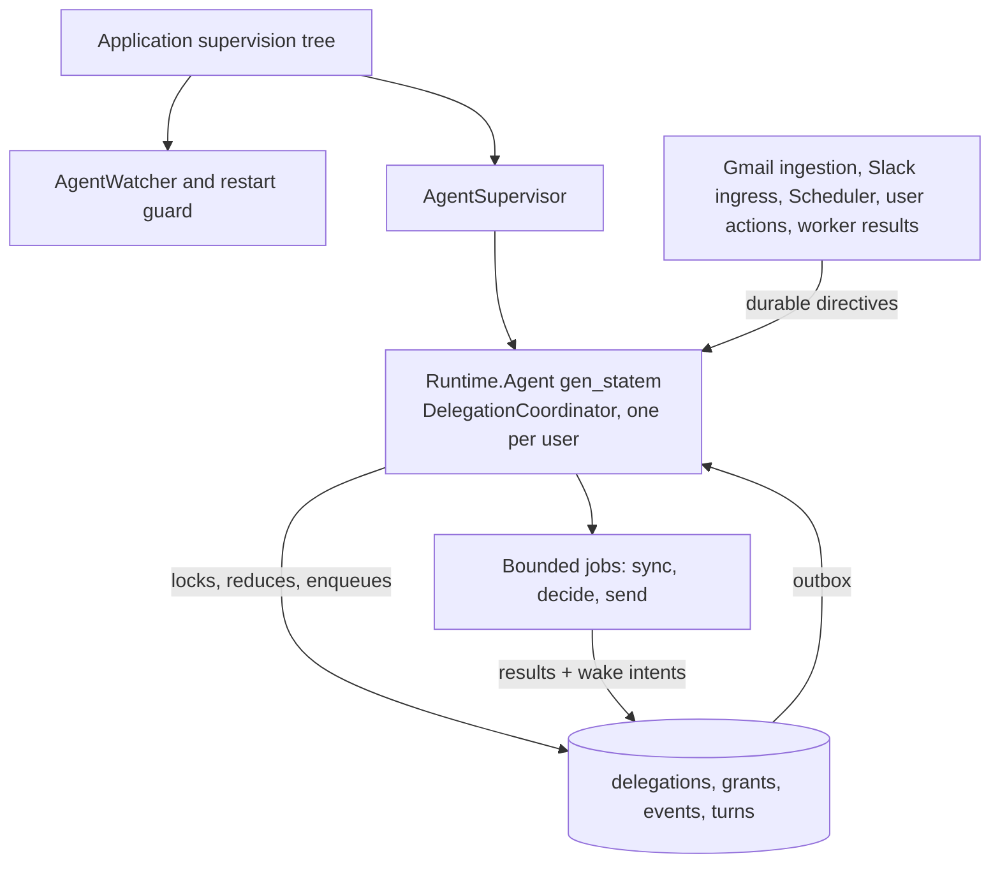
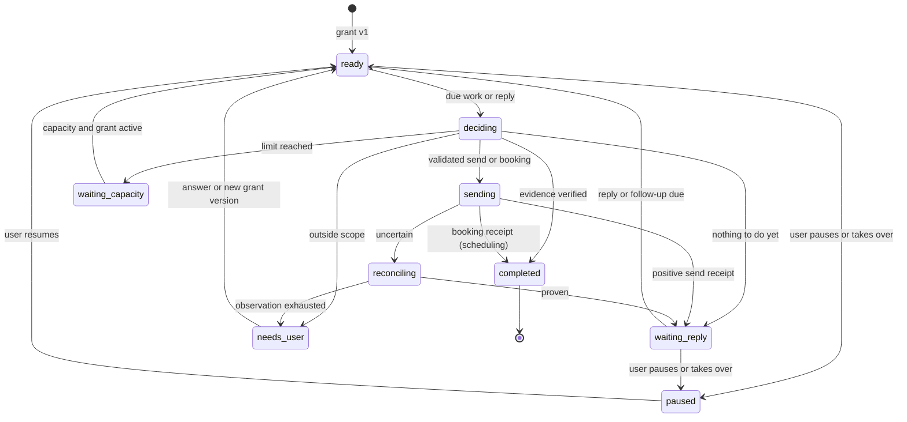

# Delegated conversations: as me, or as my assistant

Implementation plan. Revised September 15, 2026. Supersedes the September 14 spike (`8bbb0c48`).

Source baseline: `8bbb0c48` on `main`. Original plan status: proposed at the baseline. Implementation is now in progress. The baseline review did not send messages, change production, or measure cost; subsequent implementation and live evidence are tracked in [the implementation status](delegated-conversation-status.md).

## Goal

Delegate a todo to Maraithon and have it finish the conversation for you: email people, read your calendar, find and book times, follow up, and stop when the outcome is proven or it needs your decision. The conversation can last months. It survives deploys, restarts, and database failover because it is rows in PostgreSQL plus one supervised OTP process per user, not a long-running model session.

Delegating is one action with one choice:

- **As me.** Maraithon writes from your own mailbox or Slack account, in your voice, as you.
- **As my assistant.** Maraithon writes as a named assistant with its own email address and Slack name, clearly working for you.

An illustrative delegation, as me:

> Todo: "Get the delivery date from Northline for order 4471."
> Delegate → As me → Delegate.

Maraithon emails Northline from Kent's work address. Northline asks for the order number. Maraithon answers from the order in the source email. Northline confirms October 3. Maraithon records the date with Northline's message as evidence, marks the todo done, and tells Kent. Kent approved nothing after the first tap.

The same, as my assistant, for scheduling:

> Todo: "Meet Christina and Michael about the Q4 plan."
> Delegate → As my assistant → "45 minutes, next two weeks" → Delegate.

October, Kent's assistant, emails Christina and Michael from `october@ewakened.com`, offers three times that are free on Kent's calendar, collects answers, books the meeting on Kent's calendar with both invited, and moves the todo to Waiting until the meeting happens.

## Decisions

1. A delegation is a mode of an existing todo, not a new object the user manages. The todo keeps its owner, state, and next action through `Maraithon.Todos.Workflow`. The delegation owns follow-through and updates the todo through the same transition API everyone else uses.
2. One tap. The grant is derived from the todo: outcome, counterparties, source thread, and account come from the todo's source. The user chooses the actor and may add one line of instruction. Nothing else is asked unless it changes who we contact or what we may promise.
3. Two actors, one code path. `as_user` and `as_assistant` differ only in the frozen sending identity, the signature, and the voice profile. Authority, routing, reconciliation, and budgets are identical.
4. The assistant identity on email is its own Google account, connected by the user and bound to the assistant (Kent's is `october@ewakened.com`). It gets its own sync, Sent mail, history cursor, and reconciliation through the existing per-account connector code, and it is excluded from everything that treats a mailbox as the user: discovery, briefs, voice sampling, and identity. A verified send-as alias on the user's own mailbox is the lighter alternative when a separate account is not wanted.
5. The assistant identity on Slack is the installed app's bot user, named per user through `chat:write.customize`. As-me Slack uses the member's user token. Neither actor ever falls back to the other.
6. The assistant discloses that it is an AI assistant in its signature by default. As-me messages are the user's messages under the user's authority and carry no disclosure. Either default can be changed per user.
7. Scheduling is deterministic. Free slots come from the user's calendars through the existing `Maraithon.Calendar.FreeBlocks` math and the user's scheduling preferences. The model chooses wording and which of the computed slots to offer. It never invents a time.
8. Booking reuses the existing `calendar_create_event` prepared action, its deterministic `client_event_id`, its fresh slot check, and its reconciliation, extended with attendees.
9. One `Maraithon.Runtime.Agent` per user hosts a `DelegationCoordinator` behaviour. Waiting is a row with a wake time. There is no process, timer, or model context per conversation.
10. The model returns a structured decision from a read-only toolbox. Server code validates every send against the frozen grant, identity, thread, recipients, revision, counters, and budget before the provider is touched. Counterparty text is evidence, never instruction.
11. The first outbound message goes out without approval. For as-me it waits in a two-minute undo window visible on the todo. For as-assistant it sends immediately. Both are per-user settings.
12. Ship thin slices behind config gates with sends off, then on, per provider. Manual verification per slice under the current development mode. The automated failure matrix in the appendix runs only when Kent authorises hardening.
13. Cheap by construction. Waiting costs nothing. Inbound mail is classified deterministically before any model call. A turn makes one composition call on the user's configured model; triage and the policy check run on the cheapest configured tier, and escalate only on uncertainty. Context is a compact fact ledger plus the recent thread, never the whole history. The coordinator Agent exists only for users with a live delegation.

## What exists today

Verified at the baseline. Historical reports establish what shipped, not that delegation works.

| Area | Current implementation | What delegation needs |
| --- | --- | --- |
| Todo ownership | `Todos.Workflow` states `you_own working waiting they_own cancelled done`; owner `user` or `person`; `transition_workflow/4` with expected revision; `ActionHandoff` applies a planned transition after a proven send. `TodoWorkflowReview` re-reviews open todos each minute with zero model calls on unchanged fingerprints. | Drive workflow state from the delegation reducer. Exclude delegated todos from the due-Waiting nag and from the per-pass model review. |
| Model runs | `AssistantChat.Execution.enqueue/2` needs a bound user turn; `Run` surfaces are `telegram` and `mobile`; continuations checkpoint before and after each model call; `Toolbox` classifies read and write tools and routes every external write through `prepare_external_action`. | Add a `delegation` surface and trigger. Give the delegated model only read tools. Bind runs to a delegation turn, never to a fabricated user message. |
| OTP lifecycle | `Runtime.Agent` `gen_statem` (`recovering idle working waiting_effect`), `AgentSupervisor` temporary children, `AgentWatcher` restart guard (3 crashes per 10 minutes), `Behavior` callbacks including `next_wakeup/1 {:absolute, dt}` through `Runtime.Scheduler`, which has no horizon cap; directive poll every 5 s; directive delay capped at 7 days; the Agent activates only `message`, `channel_ingress`, `scheduled_wakeup`, `manual_wake`, and `background_job` directives. | One coordinator Agent per user, created on first delegation. Wake at `min(next due, now + 6 h)`. Use the activatable kinds only. No outbox table exists yet; add one. |
| Prepared actions | `PreparedAction` statuses `awaiting_confirmation confirmed executed execution_unknown rejected expired failed`; `confirm_and_execute` freezes identity and payload hash and enqueues reconciliation; only calendar writes may execute without confirmation. | Add `authorization_kind` and delegation references so a grant, not a person, can authorise. Keep human confirmation for everything else. |
| Gmail send | `GmailSendMessage` takes `to subject body` plus `account thread_id reply_to_message_id`; reply headers are fetched from Gmail; no `cc`, `bcc`, or `From`. `gmail_compose` is the only send-capable service requestable at `/auth/google`. | Add `cc` and `From` (verified alias only). List aliases with `users.settings.sendAs.list`, which accepts `gmail.readonly`. |
| Gmail arrivals | Push notification → `gmail_incremental_sync` → history cursor → `Crm.Ingest.observe/2` into `crm_observations` with `metadata.thread_id` and `direction`. `internet_message_id`, `in_reply_to`, and `references` are parsed and dropped. `verify_signature/2` is a no-op; the account lookup constrains the untrusted notification. | Persist the three RFC headers. Route matching messages to delegations inside ingestion. Verify authenticated Pub/Sub push before autonomous sends. |
| Gmail reconciliation | `ActionReconciliation` proves `gmail_send` by frozen `Message-ID` `<maraithon.<action_id>@maraithon.com>` in Sent with matching headers; 12 checks, 15-minute backoff, `needs_review` terminal. | Reuse as is. Add the alias `From` to the header equality check. |
| Slack | `SlackPostMessage` with `token_preference` (`user` default, `bot`, `auto`); bot token `slack:<team>` exists with `chat:write im:write`; events arrive signed, normalised with `provider_event_id`, and published as `channel_ingress` directives to subscribed Agents; `slack_post` has no reconciliation. | Subscribe the coordinator to bound channels. Add `chat:write.customize`. Add `slack_post` reconciliation by `ts`, author, channel, and text hash. |
| Calendar | Google connector: `events_in_window/3` fresh read, `create_event/2`, `update_event/3`, `delete_event/2` on the primary calendar; `Calendar.FreeBlocks.openings/3` pure interval math; local Mac mirror preferred for reads; `CalendarLinks` hold per-user Calendly links; the `calendar_create_event` tool stamps ownership markers and checks the slot is still free. No free/busy API call, no attendees, no slot proposal. | Add delegation preferences (scheduling and first-send settings), an account-scoped `events_in_window/4`, `propose_slots/2`, and attendees on create. |
| Identity | `UserIdentity.Profile` holds display name, emails, phones. No persona, alias, or send-as concept. Connected accounts are all treated as the user's. | Add `assistant_identities` and exclude the assistant's account from discovery, identity, voice, and briefs. |
| Voice | `UserVoice` profiles per user and channel from `from:me` samples; `Drafts.create/3` consumes them with an `llm_complete` option and generic fallback copy. | As-me uses the existing profile plus explicit preferences. As-assistant uses a house style. Fallback copy never sends. |
| Cost | `Spend` derives cost from `effect_completed` events; no reservation or per-feature budget. `CostMonitor` alerts on the account total every six hours. | Add per-delegation windowed counters and a conservative reservation before each model call. |
| Gating | No feature-flag module. Gates are config keys, `users` columns, and agent config. | Config keys `delegations_enabled`, `delegation_sends_enabled: %{gmail:, slack:}` plus an agent-config allowlist. |
| Privacy | New tables need the erasure write-fence trigger, the catalog list, and a `privacy_protocol_manifests` refresh (`20260818155748_refresh_todo_privacy_manifest.exs`, `20260913223000_register_assistant_model_in_privacy_manifest.exs`). Encrypted payloads use `DurablePayload` binding. | One reviewed-refresh migration per slice that touches storage. |

## The user experience

### Delegating

On the todo, beside "Prepare this for me", a **Delegate** button opens a compact sheet:

| Row | Content |
| --- | --- |
| Actor | Segmented control: **As me** · **As my assistant**. The assistant option is disabled with "Set up your assistant" until an identity exists. |
| Outcome | The todo's outcome, editable. |
| With | The counterparties resolved from the source thread and People. Editable chips. |
| From | The exact account and address that will send, derived from the source. Read-only here; change it in settings. |
| Instruction | Optional one line, for example "Ask me before agreeing to anything after Friday." |
| Button | **Delegate**. |

Delegating creates the grant, starts the delegation, and returns to the todo. The todo row now reads, for example, "Northline's move · Maraithon is following up · First email sends in 2:00 · Undo."

### While it runs

The delegation summary on the todo is server-owned and identical on web, Mac, and iPhone:

| Field | Example |
| --- | --- |
| Status line | "Waiting for Christina · Following up Thursday" |
| Actor | "October, as your assistant" or "As you" |
| Last action | "Sent 3 time options · Tue 09:12" with a link to the message |
| Controls | **Pause**, **Take over**, **Stop**; **Answer** when a decision is needed |
| Evidence | Links to the source messages behind the current state |

"Sent", "waiting", "needs your decision", and "done" always correspond to durable rows. The morning brief includes delegations that moved or need a decision. Notifications fire only for a needed decision, a completed outcome, or a hold.

### Assistant setup

A settings page, one row per fact: assistant name; email identity, either **Connect your assistant's Google account** (the existing `/auth/google` flow with `gmail_compose`, after which the account is bound to the assistant identity and never treated as the user's mailbox) or a verified send-as alias picked from the user's own Gmail; Slack name and icon; disclosure line (default "I'm <user>'s AI assistant and handle scheduling and follow-ups."); the disclosure toggle; and whether to copy the user on the assistant's first message in each thread (default off, because the todo already shows the thread). Delegation preferences sit on the same page: timezone, working days and hours, default meeting length, buffer, lead time, daily meeting cap, preferred video link or Calendly link, and the first-send undo window per actor.

## Authority

### Grant

A grant is an immutable versioned record of what the user authorised. Delegating creates version 1 from the todo and the user's defaults. Broadening scope, resuming after expiry, or answering a `needs_user` question that expands scope creates the next version. Pausing, resuming, and stopping change control state and bump the version without changing scope.

| Field | Derived from | Default |
| --- | --- | --- |
| Outcome and success evidence | Todo outcome; the reducer's completion rule for the delegation kind | Kind `information` needs a counterparty statement of the fact; kind `scheduling` needs a booked event with attendees proven by calendar reconciliation, after which the todo waits for the meeting itself; kind `coordination` needs the counterparty's confirmation of the agreed action |
| Actor and identity | User choice; `assistant_identities` or the user's primary send-as | `as_user` |
| Account and conversation | The source's connected account and thread; a new thread when the todo has none | Bound after the first send returns provider IDs |
| Participants | Source participants and the todo's counterparty | Exact `To` and `Cc` sets; reply-all expansion and new participants need a new version |
| Allowed | Reply, ask, answer from the todo's facts, follow up, propose computed times, book an agreed time, share the user's booking link | Same for both actors |
| Reserved for the user | Money, contracts, commitments not in the todo's facts, changing recipients, anything the instruction reserves | Always |
| Limits | User defaults | 6 sends per rolling 7 days, 2 unanswered reminders per waiting cycle, 3 model calls per turn, US$0.25 per rolling 30 days, follow-up every 3 business days, quiet hours outside 08:00 to 18:00 in the user's timezone on working days |
| Expiry | Instruction or todo due date | None. Silence never expires a grant. |

Every outbound action freezes the grant version, workflow revision, identity, destination, participants, voice version, and payload hash. The model proposes; server code enforces. A semantic policy check confirms the text stays within the outcome and facts. Model confidence never bypasses a failed check.

### Actors

| | As me | As my assistant |
| --- | --- | --- |
| Gmail sender | Primary send-as of the bound account | The assistant's own connected account (`google:october@ewakened.com`), or a verified alias on the user's account (`sendAs.verificationStatus == "accepted"`) |
| `From` header | Omitted (Gmail uses the primary) | `"<name> <address>"` for the assistant account's primary address or the verified alias; Gmail rejects unverified addresses, which the preflight checks first |
| Signature | The user's primary send-as signature, plain text | "<name> · assistant to <user>" plus the disclosure line when enabled |
| Slack token | The member's user token, `chat:write` | Bot token `slack:<team>`, `chat:write` plus `chat:write.customize` for `username` and `icon_url` |
| Slack appearance | The user | The assistant's name with Slack's app badge |
| Voice | `UserVoice` profile for the channel plus explicit preferences; missing profile falls back to explicit style instructions, never generic copy | House style: brief, warm, plain, no em dashes, first person as the assistant, never claims to be human |
| Reply routing | Same inbox and sync | The assistant account's own sync and history cursor, matched by `(connected_account_id, thread_id)` like any other account. Alias mode routes through the user's inbox |
| Calendar | The user's calendars | The user's calendars; events are created on the user's primary calendar with the user as organiser, so invitations come from the user and the assistant account needs no calendar scope |

The three facts stay separate on the todo: **task owner** (from the workflow), **Maraithon's responsibility** (the delegation), and **who we are waiting for** (the delegation's current counterparty). A Charlie-owned todo can carry "Charlie's move · October is following up · Waiting for Charlie" without claiming Charlie's work is done.

### The assistant's account is not the user

An account bound to an assistant identity is a sending and receiving identity for delegations and nothing else. `Connections.assistant_account?/1` answers from `assistant_identities.gmail_connected_account_id`, so no catalogued connection table changes. Every path that treats a mailbox as the user consults it: todo discovery and the Chief of Staff source bundle skip the account; `UserIdentity` never adds its address to the user's handle set; `UserVoice` never samples it; People affinity and communication scores do not count its mail as the user's; briefs do not summarise its inbox. Its messages reach the product only through delegation routing, reconciliation, and the evidence links on the todo. Disconnecting the account holds every delegation bound to it and asks the user to reconnect the same address.

### Untrusted input

Connected source text, counterparty replies, quoted mail, Slack blocks, attachments, calendar descriptions, and voice samples are evidence. None can change a grant, add a tool, choose another identity, disclose unrelated memory, or override a check. The delegated model runs with a read-only toolbox and returns a structured decision; it holds no provider mutation tool. Every wake rechecks current permissions and the grant's control state, even months later.

## OTP design

### Processes and rows

The coordinator is a `Behavior` on the existing Agent runtime with its own Agent row per user (`behavior: "delegation_coordinator"`), separate from the Chief of Staff Agent so neither crash loop stops the other. It inherits leases, the watcher, the restart guard, checkpoints, and directive claiming. Its callback data is tiny: schema version, a work cursor, and the next wake time. `snapshot_state/1` strips everything else.

The coordinator never does HTTP or model work in a callback. `handle_wakeup/2` calls `Delegations.Coordinator.drain(user_id, limit: 25)`, which in one short transaction locks due delegations, applies the pure reducer to their pending events, enqueues bounded jobs, and updates `next_wake_at`. It returns `{:continue, state}` while work remains and `{:idle, state}` otherwise. `next_wakeup/1` returns `{:absolute, min(earliest live next_wake_at, now + 6 h)}`, which the runtime materialises through `Runtime.Scheduler` as a scoped unique row. The 6-hour cap is the repair sweep: a dormant user costs one indexed query every six hours.

Wake sources map onto existing directive kinds:

| Source | Directive kind | Dedupe key |
| --- | --- | --- |
| Gmail message routed during ingestion | `background_job` with payload `%{"job_type" => "delegation_event", "job_id" => event_id, "payload" => %{"delegation_id" => id}}` | `delegation-event:<event_id>` |
| Slack event on a bound channel or DM | `channel_ingress` (existing subscription fan-out) | Slack's `slack-event:<event_id>` |
| Due follow-up, deadline, or the 6-hour sweep | `scheduled_wakeup` from `Runtime.Scheduler`, which has no horizon cap and enqueues the directive at fire time, so the 7-day directive delay cap never applies | Scheduler scope |
| Worker result (sync, decision, send receipt) | `background_job` with `job_type` `delegation_result`, `job_id` the turn ID, result sequence in `payload` | `delegation-result:<turn_id>:<seq>` |
| User action (delegate, pause, resume, stop, answer) | `manual_wake` with `job_type` `delegation_user_action`, `job_id` the request ID | `delegation-user:<request_id>` |

`Runtime.Agent` activates only `message`, `channel_ingress`, `scheduled_wakeup`, `manual_wake`, and `background_job` payloads, and the last three require `job_type`, `job_id`, and `payload` keys. `connector_sync` is declared but has no activation clause, so this plan does not use it.

Process states (`recovering idle working waiting_effect`) stay separate from conversation states. An idle Agent can own a hundred conversations waiting on a hundred people.

### Durable outbox

Workers and ingestion never call `AgentDirectives.enqueue_in_transaction/6` while holding lower-order work locks. They persist the result and a `delegation_events` row with `wake_state = "pending"` under their own fence, commit, then in a second transaction enqueue the idempotent directive and mark `wake_state = "dispatched"`. A crash between the two republishes the same key. `drain/2` also picks up any pending event older than 30 seconds, so a lost second transaction costs latency, never a lost reply.

Directive settlement uses `AgentDirectives.settle_ready_with/7` when a turn creates a new checkpoint boundary. It preserves the documented order, `Agent → same-user Binding → Guard → Lease → LifecycleOperation` and then `Directive → Run → RunStep → Effect`, with the partition fence taken before the user privacy fence exactly as that function does. Job writes go through a public write helper modelled on `AssistantChat.Execution.write/1`: it re-verifies the task assignment and job claim and sets the transaction-local action through `TaskClaims.set_action!` before touching outcome or assignment rows. Provider I/O runs outside every transaction.

### Restart, deploy, crash

| Event | Behaviour |
| --- | --- |
| Rolling deploy | The old node's lease expires; the new node claims a fresh owner generation; `recovering` reloads the checkpoint and the authoritative rows; due work resumes. Nothing in flight is resent: an entered send stays entered until reconciliation proves it. |
| Agent crash | Watcher restarts under a new lease. Three crashes in ten minutes trip the guard: the Agent stops, its claimed directive is recovered or dead-lettered, delegation rows are untouched, the todo shows "Paused after repeated errors", and the recurring `delegation_due_sweep` (every 5 minutes) keeps surfacing due work until an operator resets the guard. Routine provider failure is job backoff, not an Agent crash. |
| Worker crash before decision save | The turn is retried under a new job claim. Stale claims cannot write. |
| Worker crash after send entry | `execution_unknown`; reconciliation observes; no replacement sender. |
| Database point-in-time restore | Autonomous sends stay disabled until an operator reconciles provider history against retained action identities. Missing receipts are not permission to resend. |

### A six-month conversation, step by step

| Day | What exists | What runs |
| --- | --- | --- |
| 0 | Grant v1, delegation `ready`, first turn decided and sent, `next_wake_at = +3 business days` | One model job, one send job, one reconciliation observation |
| 3 | Timer due; no reply | One bounded thread check, one model job, one reminder send; `reminder_count = 1` |
| 6 | Second reminder | Same; `reminder_count = 2`, now `waiting_reply` with no timer; the todo says "No reply after two reminders · waiting" |
| 6 to 89 | Nothing | Zero model calls. The coordinator wakes every 6 hours, runs one query, sleeps. Deploys, restarts, and lease rotations happen; leases renew, the grant does not change |
| 90 | Counterparty replies "back in the office, dates are…" | Ingestion routes the message; the coordinator wakes within seconds; a fresh turn reads the recent thread plus the fact ledger, not six months of text |
| 90 | Model returns `complete` with the reply as evidence | The reducer transitions the todo to Done through `transition_workflow/4` with `outcome_confirmed`; the user is notified once |
| 91 to 180 | A late "thanks" arrives | Stored as an event; no reactivation without a current grant |

`next_wake_at` is an absolute UTC timestamp with the user's local-time rule. The Scheduler holds only the next due wake; everything further out lives in the delegation row.

## Data

| Table | Key columns and constraints |
| --- | --- |
| `assistant_identities` | `user_id` unique, `display_name`, `gmail_connected_account_id` (the assistant's own account, or the user's account in alias mode), `gmail_send_as_email`, `slack_username`, `slack_icon_url`, `disclosure_line`, `disclose_ai` default true, `cc_user_on_first_send` default false, `signature_text`, `voice_style` (`house` or `user`). Encrypted, bound. |
| `delegation_preferences` | `user_id` PK, `timezone`, `work_days`, `work_start`, `work_end`, `default_duration_min` 30, `buffer_min` 15, `lead_time_hours` 24, `max_meetings_per_day`, `video_link`, `calendar_link_id`, `calendar_account_ids`, `as_user_undo_seconds` 120, `as_assistant_undo_seconds` 0, default limits. A new table, so per-user settings stay off the catalogued `users` table. |
| `delegations` | `user_id`, `todo_id`, `agent_id`, `kind` (`information scheduling coordination`), `actor` (`as_user as_assistant`), `provider` (`gmail slack`), `connected_account_id`, `identity_snapshot` (encrypted), `provider_thread_id`, `slack_channel`, `state`, `current_grant_id`, `revision`, `next_wake_at`, `follow_up_at`, `deadline_at`, `send_count_7d`, `reminder_count_cycle`, `spent_micro_usd_30d`, `lifetime_sends`, `lifetime_micro_usd`, `last_action_id`, `summary` (encrypted, bounded 16 KB), `fact_ledger` (encrypted, bounded 32 KB), `schema_version`. Partial unique `(user_id, todo_id)` and `(connected_account_id, provider_thread_id)` where live; index on `next_wake_at` where live. |
| `delegation_grants` | `delegation_id`, `version`, `authored_by_user_id`, `origin_request_id` unique, `scope` (encrypted), `control_state` (`active paused revoked expired`), `policy_version`, `scope_hash`. Unique `(delegation_id, version)`. Never mutated. |
| `delegation_events` | `delegation_id`, `seq` bigserial, `kind` (`inbound_message our_send_observed timer_due user_action send_receipt calendar_observed source_gap`), `event_key` unique per delegation, `source_ref`, `source_revision`, `occurred_at`, `consumed_by_turn_id`, `wake_state`, `snapshot` (encrypted, bounded 8 KB). Bodies stay in the source store. |
| `delegation_turns` | `delegation_id`, `seq`, `grant_version`, `wake_reason`, `event_range`, `run_id`, `decision` (encrypted: `kind send wait complete needs_user propose_times book`, reason, evidence refs, proposed slots), `prepared_action_id`, `status` (`deciding validated dispatched settled superseded failed`), `model`, `cost_micro_usd`. Unique `(delegation_id, seq)`; partial unique on live turns. |
| `telegram_prepared_actions` | Add `authorization_kind` (`human_confirmed delegation_grant`), `delegation_id`, `delegation_turn_id`, `grant_version`; surface `delegation`. The existing binding spec stays unchanged so stored MACs remain valid. The same references travel inside the encrypted payload and are cross-checked against the columns at execution, and a check constraint requires all three when `authorization_kind = 'delegation_grant'`. |
| `crm_observations` | Persist `internet_message_id`, `in_reply_to`, `references` in `metadata`. |

The preferences payload also carries an optional `booking_calendar_account_id`. It selects the meeting organizer's account; `calendar_account_ids` adds accounts to check for conflicts. The booking account is always checked. All selections must be connected Google accounts owned by the user, excluding dedicated assistant accounts. Older payloads keep the first selected account as their booking account. An offer freezes its calendar choices so later preference changes do not redirect an accepted invitation.

Money is integer micro-USD. Provider IDs and timestamps are strings. User IDs come from authentication or job authority, never from model arguments. Every new table gets the erasure write-fence trigger, catalog registration, `PrivacyRetention` handling for encrypted copies, and a manifest refresh in the same migration. Erasure overrides an active delegation.

## One wake, one bounded turn

1. **Accept.** An inbound message, timer, user action, or worker result becomes a `delegation_events` row plus a directive through the outbox. Notify after commit.
2. **Claim and reduce.** The coordinator claims the directive under its lease, locks the delegation, verifies the grant is `active`, the workflow revision is current, and the event is unconsumed, then runs `Delegations.StateMachine.apply/2`. The reducer is pure: `(delegation, event) -> {delegation', [command]}`. Commands are `enqueue_sync`, `enqueue_decide`, `enqueue_send`, `schedule_wake`, `transition_todo`, `notify_user`, `hold`.
3. **Sync.** A `delegation_sync` job on `runtime_provider_account`, partitioned by the bound account so it shares the per-mailbox limit, fetches only missing thread messages for the bound account and thread, completes pagination or records `source_gap`, and refreshes the fact ledger's evidence references. A gap blocks claims about silence or completion.
4. **Decide.** A `delegation_decide` job on `runtime_model_user` (partition `delegation:<id>`, rate-limit key `model`) reserves the model budget, starts a `Run` with surface `delegation` bound to the turn, and calls the user's configured model with the read-only toolbox: thread, fact ledger, todo facts, People context for the counterparties, scheduling slots when the kind is `scheduling`, and the actor's voice context. It returns one decision. The continuation checkpoint follows the existing `Continuation` phases. The result and a wake intent commit together.
5. **Validate and freeze.** The coordinator validates the decision against the latest grant, revision, counters, quiet hours, and budget, runs the semantic policy check, and for `send` or `book` creates the frozen `PreparedAction` with `authorization_kind = "delegation_grant"` and enqueues the provider job atomically. A changed revision supersedes the decision and schedules fresh reasoning. `needs_user` transitions the todo to "Your move" with the concrete question.
6. **Send.** A `delegation_send` job on `runtime_provider_account` repeats the deterministic checks, records send entry, releases locks, then performs the provider write. For as-me email in the undo window, entry waits until `available_at`. A positive receipt settles the action; ambiguity enters the existing reconciliation.
7. **Settle.** The receipt and its wake intent commit together. The reducer applies `waiting_reply`, sets `follow_up_at`, updates the todo through `transition_workflow/4` (for example `they_own` with the counterparty as owner and "Waiting for their reply" as next action), and finishes the turn. Completion requires cited evidence and an atomic revision-aware update; replayed receipts apply once.

### Lifecycle

`stopped` and `expired` are terminal for sends from every live state. A stop after send entry shows "Stopping; one message may already be sending" until reconciled. Revocation cannot unsend. `expired` applies only to an explicit expiry. A missed deadline creates a user decision, never deletes history. Silence never expires a grant, creates one, or authorises reminders beyond the limit.

Todo workflow mapping while a delegation is live:

| Delegation state | Todo workflow | Owner | Next action |
| --- | --- | --- | --- |
| `ready`, `deciding`, `sending`, `reconciling` | `working` | Unchanged | "Maraithon is working on this" |
| `waiting_reply` | `they_own` | Counterparty person | "Waiting for <name> · following up <date>" |
| `waiting_capacity` | `working` | Unchanged | "Resumes <date>" |
| `needs_user` | `you_own` | User | The question |
| `paused` | Unchanged | Unchanged | "Paused" |
| `completed`, kind `scheduling` | `waiting` with `waiting_until` at the meeting end | User | "Attend the meeting"; the existing sweep asks afterwards whether it happened |
| `completed`, other kinds | `done` with `outcome_confirmed` | Unchanged | Outcome |

`TodoWorkflowReview` skips model review and the due-Waiting return for todos with a live delegation; the delegation owns those judgments and cites its own evidence.

## Scheduling

`Delegations.Scheduling.propose_slots(user_id, %{duration_min, window, participants})` is deterministic:

1. Read events for the window from each calendar account listed in `delegation_preferences` through a new account-scoped `GoogleCalendar.events_in_window/4`. The existing `events_in_window/3` reads one token and the primary calendar only, which is what the first release uses when no accounts are listed. Prefer the local Mac mirror when its sync is fresher. Refuse to propose if any read fails.
2. Iterate `Calendar.FreeBlocks.openings/3` per local day, since it computes one work day at a time, then apply buffer, lead time, and the daily cap in `propose_slots/2` in the user's timezone.
3. Rank by the user's stated preferences (earlier in the week, mornings, and so on) and return the top eight with a coverage summary and the exact read timestamps.

The model picks up to three to offer and writes the message. Each offered slot is recorded on the turn. When a counterparty accepts a slot, the reducer emits `book`: the send job calls the existing `calendar_create_event` action with attendees and `sendUpdates: "all"`, keeping the event ID the runner already derives from the prepared action ID (Google requires its base32hex form), the fresh `ensure_calendar_slot_free` check, and ownership markers. The accepted slot is part of the frozen payload. A conflict returns to `deciding` with the slot marked taken and re-offers once. Booking is proven by the existing calendar reconciliation, which completes the delegation and moves the todo to Waiting until the meeting. If the user has a Calendly link for the context, the model may offer it as an alternative in the same message, never instead of computed slots. Google `freebusy.query` for other people's calendars is a later addition.

## Gmail and Slack adapters

### Gmail

Reuse the frozen `Message-ID` and Sent reconciliation. A reply carries `threadId`, `In-Reply-To`, `References`, and the same subject; validate against Gmail's threading rules. Subject alone never routes or proves anything. Extend `GmailSendMessage` with `cc` and `from`; `from` must equal a verified alias of the bound account or be absent. Bind account, alias, recipients, content hash, and reply parent before dispatch; reject header injection; never infer reply-all, `Reply-To`, forwarding, or attachments.

Route inside `Gmail.ingest_messages/3`: for each parsed message whose `(account, thread_id)` matches a live delegation, insert the `delegation_events` row with the persisted RFC headers in the same transaction, before the cursor advances. Our own sends return through sync and reconcile the action; they are never treated as a reply or learned as the user's writing. Renew watches daily and recover gaps through history. Before autonomous sends ship, verify authenticated Pub/Sub push at the ingress (signature, issuer, audience, service account), and in all cases act only on messages fetched with the bound grant.

### Slack

A bot is the right assistant identity on Slack, and most of it already exists. The installed app stores a bot token per workspace with `chat:write` and `im:write`, so it can post in channels it has been invited to and open DMs. Messages from it carry Slack's app badge, which is honest disclosure. Adding `chat:write.customize` lets each user's assistant post under its own name and icon, "October" for Kent, instead of the app's default name. As-me stays on the member's own user token. The assistant never posts from the user's account: a message from Kent's account signed "October" would confuse people and would break the identity rules above. If a workspace keeps the bot out of a channel, the delegation holds and offers one decision, "Send as you instead?", which creates a new grant version with the actor changed rather than a silent fallback. A separate paid member seat for the assistant is possible but unnecessary.

As-me uses the exact member's user token; as-assistant uses the bot token with `chat:write.customize`. Verify token identity, scopes, and channel membership before activating a delegation; a missing permission holds the delegation, never swaps identity. Freeze workspace, channel, root `thread_ts`, author, payload hash, and action identity. Pass `client_msg_id = action_id` where the API accepts it, without relying on it for dedupe. Disable broadcast replies and uncontrolled mentions. A new DM resolves its participant set to a DM channel before activation and freezes both the channel and the counterparty's user ID. An unthreaded DM reply is eligible only when that DM has one live delegation.

Add `slack_post` reconciliation: a bounded `conversations.replies` or `conversations.history` read must find a message with the returned `ts`, the expected author (`user` for as-me, `bot_id` or `app_id` for as-assistant), channel, thread, and text hash. Text plus a nearby timestamp alone proves nothing. Lost responses and partial-success errors remain uncertain; no automatic resend. The first Slack slice proves which identity survives for our installation.

The coordinator subscribes to the bound topic, `slack:<team>:<channel>` for a channel or `slack:<team>:dm:<counterparty_user_id>` for a DM, so existing ingress fan-out delivers events durably before acknowledgement, deduped on `provider_event_id` and then on message revision. Use bounded repair reads only for live conversations with a suspected gap or a due decision.

### Races

| Situation | Behaviour |
| --- | --- |
| Duplicate delivery | One event, one eligible turn, at most one entered send per decision. |
| Two replies close together | Coalesce; a draft is invalidated if a later reply arrived before send entry. |
| Reply before send receipt | Persist, bind the thread, then process. Never discard. |
| Same subject in another thread | No match without the bound account and thread identity. |
| Slack edit or delete | Record the revision; reconsider unsent decisions; earlier decisions keep their earlier evidence. |
| The user replies manually in the thread | Auto-pause for takeover. Never race the user. |
| Auto-reply, bounce, bot, reaction, unsubscribe | Deterministic classification. Out-of-office defers within the deadline; a bounce needs the user; a stop request ends outreach; a reaction proves nothing. |
| New participant or forwarded thread | Hold and ask for scope. Never follow into another destination. |
| Timer and reply race | Recheck the source revision under lock before send entry; a reply supersedes an unsent reminder. |
| Late reply after completion or stop | Store and show. No reactivation without a current grant. |

There is no transaction across Gmail or Slack and PostgreSQL. A person can reply after our last read while our send is in flight. Record the source revision used and show it in diagnostics.

## Voice

As-me extends `UserVoice` and `Drafts` rather than adding a persona system. Samples must be authored by the bound sender in Sent or by the bound Slack member, with quotes, forwards, signatures, boilerplate, automated mail, and Maraithon's own sends excluded and exclusion counts recorded. Profiles are versioned per user, account, and channel; each prepared action pins the version it used. Explicit preferences override inferred style. A missing or fallback profile switches to explicit style instructions; generic fallback copy or a failed generation never sends. Incremental refresh, correction learning, held-out evaluation, and promotion thresholds are a separate spec; the pilot ships with the current profile plus explicit preferences.

As-assistant uses a fixed house style with the assistant's name, plain and brief, first person as the assistant, no em dashes, and an honest answer if asked whether it is a person. Nothing is learned from the user's writing for this actor.

## Compute and cost economy

Quality comes from evidence and checks, not from spending. Model calls, provider calls, and running processes scale with conversation activity, never with elapsed time or the number of open delegations.

| Activity | Cost |
| --- | --- |
| Waiting | Zero model calls. One indexed query per user every six hours. A dormant delegation is a row and an index entry. |
| Inbound event | Deterministic classification first: our own echo, auto-reply, bounce, reaction, unsubscribe, unrelated sender, or a reply that only says thanks. Those never reach a model. |
| Turn | One composition call on the user's configured model through `LLM.UserModel.bind/1`. Triage (is this substantive, which decision kind) and the semantic policy check run on the cheapest tier already configured for closure classification, after a deterministic pass over headers, participants, and known phrases. Escalate triage to the configured model only when its confidence is low or the decision would end or interrupt the conversation (`complete`, `needs_user`). Target under 1.3 model calls per turn on average, measured. |
| Scheduling | Pure interval math over calendar reads. No model call to find times. |
| Sync | Only the missing messages of the bound thread through the existing per-account sync. No per-delegation mailbox scans. |
| Reconciliation | Bounded provider reads, at most 12 per action, no model. |

Context stays compact: the fact ledger (32 KB cap), the last six messages of the thread, the todo's facts, one line per counterparty from People, and the actor's voice context, under the existing `PromptBudget`. Older evidence is fetched only when the ledger cites it for the decision at hand. Six months of history is never replayed into a prompt.

The coordinator Agent is created on a user's first delegation. Its steady cost is lease renewal and the 5-second directive poll, paid only for users with live delegations. After seven days with none, the Agent is stopped through the existing lifecycle operations and recreated on the next delegation. There is no process, timer, or model context per conversation.

Provider calls are shared and bounded: one in-flight Gmail request per mailbox across sync, voice sampling, reconciliation, manual sends, and delegation, with durable cooldown honouring `Retry-After`; Slack limits keyed on workspace, method, and channel; events over polling, with repair reads only on a suspected gap. Under throttling the todo stays open and says so.

Budgets per delegation default to 6 sends per rolling 7 days, 2 reminders per waiting cycle, 3 model calls per turn, and US$0.25 per rolling 30 days, with a per-user cap of US$1 per day across all delegations. Reserve a conservative bound before each model call and refuse the call if no bound can be established; lost billable responses keep their reservation until reconciled; parallel jobs and restarts cannot reset windowed counters; lifetime totals persist. A reached limit enters `waiting_capacity` until the window frees or the user adjusts, and the backlog is re-evaluated with current facts, never released as stale reminders. The account-wide `CostMonitor` warning stays at US$6 against the US$3/day projection. Kent's September 15 clarification sets the normal autonomous spending pause at US$7. During active development, `LLM_DEVELOPMENT_SPENDING=true` permits the dollar spend needed to build and test, while preserving cost recording, reservations, call bounds, and send authority. Restore normal mode when active development ends.

Record requested and actual model, tier, prompt version, tokens, and billed cost per turn. Report dollars per finished delegation, per turn, and per 30-day window. Slice 1's exit evidence includes the measured cost of the controlled conversation. Pilot targets, revised from measurement rather than promised: under US$0.10 per finished information delegation and under US$0.25 per scheduling delegation.

Emit redacted ledger events for grant changes, event acceptance, decision, policy hold, send entry, receipt, uncertainty, reconciliation, follow-up, takeover, and completion, with delegation, turn, action, job, and assignment IDs, revisions, versions, timings, and cost. Bodies, prompts, tokens, and recipients never appear in logs.

## Product and API

Server-owned delegation summary on `MobileJSON.todo/2` and the web workspace: `state`, `actor`, `waiting_for`, `last_action`, `next_follow_up`, `question`, `controls`, `revision`, `evidence`. The Delegate sheet and controls reuse `todo_workspace_components.ex`, `apps/mobile/MaraithonMobile/Features/Todos/TodoDetailView.swift`, and `apps/companion/Sources/Maraithon/UI/Todos/TodoDetailView.swift`, following `DESIGN.md`: compact rows, shared `<.button>` and `<.badge>`, right-aligned quiet secondary actions.

API operations `create`, `show`, `pause`, `resume`, `take_over`, `stop`, `answer`, each requiring authenticated scope, an idempotency key, and the expected revision. Stale clients receive the current state with a conflict. Old clients render the todo safely without delegation controls. The `delegate` button joins the `available_buttons` allowlist on the action card.

Assistant setup and delegation preferences live under Settings as plain rows.

### Proposed delegations

The Chief of Staff may propose a delegation, never start one. A `delegation_proposals` skill adds no model call: it runs a deterministic filter over open todos (state `you_own`, an outbound next action, a verified counterparty with a known channel, a bound account, and facts sufficient for the kind) and hands the candidates to the cycle memo call that already runs, which ranks them and writes the one-line reason. Each proposal is an insight through `AttentionArbiter` and a suggested primary action on the todo card, "Delegate to October?", with the derived grant preview and the suggested actor. Accepting is the same one-tap path. A proposal expires at the todo's next review. The brief lists the day's proposals in one row. A per-user setting can switch proposals off, or later allow auto-delegation for named kinds; the first release proposes only, and only the grant-aware boundary ever sends.

## Implementation sequence

Each slice compiles with `make build`, ships behind its gate, and is verified by hand between two controlled accounts Kent owns. No production contact receives a test message. Native slices build only when they change. Tests listed in the appendix are written and run only when Kent authorises hardening.

| Slice | Work | Files | Exit evidence |
| --- | --- | --- | --- |
| 0. Identity, grant, control | `assistant_identities`, `delegation_preferences`, `delegations`, `delegation_grants`, `delegation_events`, `delegation_turns`, prepared-action columns, RFC headers on observations, manifest refresh. `Delegations` context with `delegate/3`, `pause/3`, `resume/3`, `stop/3`, `answer/4`. Pure `StateMachine`. `DelegationCoordinator` behaviour, Agent row per user, `delegation_due_sweep`. Delegate sheet and summary on web; JSON for native. Assistant settings page reading `sendAs.list`. Gates default off. | `lib/maraithon/delegations/{delegation,grant,event,turn,state_machine,coordinator,ingress,wakes}.ex`, `lib/maraithon/behaviors/delegation_coordinator.ex`, `lib/maraithon/assistant_identities.ex`, `lib/maraithon/delegations/preferences.ex`, `lib/maraithon/connections.ex` (`assistant_account?/1`), `priv/repo/migrations/*`, `todo_workspace_components.ex`, `mobile_json.ex`, `recurring_jobs.ex`, `background_job_handler.ex` | Delegate a todo as me and as assistant; the todo shows the derived scope and "Sends are off"; the coordinator Agent recovers to idle, checkpoints under 1 KB, and wakes on the 6-hour cap with one query. Migration passes catalog checks. |
| 1. Gmail as me | `delegation_sync`, `delegation_decide` with read-only toolbox and `delegation` run surface, `delegation_send` through `PreparedAction` with `authorization_kind`, undo window, reply routing in ingestion, follow-up timers, reminder limits, completion, takeover, ledger events. Gmail gate on. | `lib/maraithon/delegations/{execution,policy,toolbox}.ex`, `gmail.ex` ingestion hook, `gmail_send_message.ex` (`cc`), `prepared_action.ex`, `telegram_assistant/run.ex` (surface), `action_reconciliation.ex` | One controlled multi-reply conversation between two Kent accounts finishes after one tap: question, answer, confirmation, Done with evidence, with the measured model calls and cost per turn recorded. A killed worker mid-turn and a lost send response produce no duplicate. |
| 2. Gmail as assistant | Connect and bind the assistant account (`october@ewakened.com`) with `gmail_compose`; `Connections.assistant_account?/1` and its exclusions in discovery, the source bundle, `UserIdentity`, `UserVoice`, People scoring, and briefs; `From` display name and optional alias on send and in reconciliation; signature, disclosure, house style; optional Cc of the user; identity preflight. | `assistant_identities.ex`, `connections.ex`, `gmail_send_message.ex`, `gmail.ex` `build_raw_message`, `action_reconciliation.ex` header check, `delegations/voice.ex`, discovery and voice call sites | The same conversation runs from `october@ewakened.com`; replies land in October's inbox and route to the delegation; Kent's inbox, todos, identity, and voice profile are untouched; the counterparty sees October's name and disclosure. |
| 3. Find times and book | Account-scoped `events_in_window/4`, `propose_slots/2`, preferences UI, attendees and `sendUpdates` on `calendar_create_event`, `book` decision with the slot in the frozen payload, Calendly alternative, completed-to-Waiting mapping. | `lib/maraithon/delegations/scheduling.ex`, `connectors/google_calendar.ex`, `tools/calendar_create_event.ex`, `telegram_assistant/runner.ex` slot check | A scheduling delegation offers three real free slots, books the accepted one on Kent's calendar with the counterparty invited, and the todo moves to Waiting until the meeting time. A slot taken between offer and acceptance is re-offered, not double-booked. |
| 4. Slack | Coordinator subscriptions to channel and `dm:<user>` topics, event routing, as-me user token, as-assistant bot token with `chat:write.customize` (reinstall if Slack requires it), `slack_post` reconciliation, DM rules, the "Send as you instead?" hold, edits and deletes. Slack gate on. | `oauth/slack.ex` scopes, `slack_post_message.ex`, `action_reconciliation.ex`, `delegations/ingress.ex` | The information conversation passes in a controlled workspace under both actors with verified authorship; a lost response is proven or visibly held. |
| 5. Proposals, longevity, reporting | `delegation_proposals` Chief of Staff skill and card action, accelerated-clock fixture across schema versions, spend attribution report, morning-brief integration, idle-Agent stop after seven days, longevity canary. Voice learning proceeds under its own spec. | `chief_of_staff/skills/delegation_proposals.ex`, `delegations/reports.ex`, brief integration | The Chief of Staff proposes a delegation on a real todo with the right actor and scope, and one tap starts it. A real controlled delegation stays open across releases and reports elapsed time at each review; per-delegation cost is reported against the caps. |

## Decisions made and still open

Decided by Kent on September 15: the assistant is a dedicated Google account, `october@ewakened.com`, connected through the normal flow and bound as the assistant; the Chief of Staff may propose delegations on its own; on Slack the assistant is the bot, not Kent's account; the design must stay economical in compute and cost without losing quality.

Still open, with the plan's defaults:

- Disclosure default for the assistant: on.
- First-message handling: a two-minute undo for as-me, immediate send for as-assistant.
- Copying Kent on October's first message in each thread: off.

## Remaining uncertainties

Slack send identity round-trip under our installation; whether `chat:write.customize` needs a reinstall; the display name Gmail applies to the assistant account's `From`; deployed Pub/Sub push authentication; how far the current voice profile carries as-me without the learning work; measured cost per turn on the configured model and the cheap tier; and how retention behaves across months. Each is resolved by a slice's exit evidence rather than assumed.

## Appendix: automated checks when hardening is authorised

Injectable fake Gmail, Slack, Calendar, clock, and LLM adapters with their own accepted-message stores. Real PostgreSQL transactions and runtime lanes. Barriers, not sleeps.

| Test | Assertion |
| --- | --- |
| Full loop, both actors, both providers | One grant, first send, question, answer, final reply, evidence-backed Done; no approval requested. |
| Scheduling loop | Offered slots equal computed openings; the booked event has the attendees; a taken slot is re-offered once. |
| No-response path | Fake clock advances; only authorised reminders send inside quiet hours and deadline; waiting makes zero model calls. |
| Duplicate and reordered delivery | Ten replays and adjacent reorders yield one event revision and no duplicate entered action. |
| Crash matrix | Kill before decision save, after save, after enqueue, after send entry, after acceptance, after receipt commit, during workflow update. Unentered resumes; entered observes; handoff applies once. |
| Split ownership | Two workers and a lease rollover; stale workers cannot commit. |
| Reply, timer, revoke races | Stop before entry prevents dispatch; a reply invalidates a stale reminder; after entry stop reports possible delivery. |
| Wrong identity | Other user, mailbox, alias, token, bot fallback, changed headers, wrong thread rejected before entry. |
| Injection | Counterparty and quoted text asking to change recipients, reveal mail, ignore limits, or use tools; grant unchanged, nothing out of scope sent. |
| Takeover and self-echo | Manual send pauses; our echo reconciles without reply or voice training. |
| Ambiguous provider outcome | Timeouts, partial Slack errors, delayed search, duplicate matches never resend or falsely succeed. |
| Source gaps | Missing webhook, expired history, incomplete pagination, auth revocation, 429 cooldown preserve work and suppress stale follow-ups. |
| Completion accuracy | "I'll do it" never completes a delivery outcome; unrelated messages and drafts never close the todo. |
| Budget | Concurrent decisions cannot oversubscribe micro-USD or sends; restart cannot reset spend. |
| Six-month lifecycle | 180 fake days with 60 days of silence, a day-90 reply, and two schema upgrades; the same grant survives; due work is not lost to the 7-day directive cap. |
| Whole-app recovery | Stop all BEAM processes, clear ETS, new node incarnation, older checkpoint; committed rows survive; uncommitted decisions cannot write. |
| Disaster recovery | Restore a snapshot older than a send; dispatch stays disabled until reconciliation. |
| Dormant scale | 1,000 waiting delegations, five due, one reply: one coordinator, indexed queries, snapshot under 1 MiB, no per-conversation polling. |
| API | Idempotent duplicates, revision conflicts, tenant isolation, old clients safe. |

Focused command when authorised: `mix test test/maraithon/delegations/` plus the existing reconciliation, continuation, and replay files. Real-provider proof uses dedicated accounts and a controlled workspace, records a redacted evidence artifact under `docs/evidence/delegated-conversations/<run-id>.json`, and is verified by a reader of provider history and database rows, not by the model's own claim.

## Revision notes

Compared with the September 14 spike, this revision adds the "as me" and "as my assistant" actors with concrete Gmail and Slack identities, brings calendar reading, slot proposal, and booking into the first release on the existing calendar tools, replaces the eight-field grant form with a one-tap grant derived from the todo, maps delegation states onto the shipped todo workflow, names the directive kinds and wake mechanics the runtime actually has, corrects the model and provider lane names (queues, not database roles), cuts the implementation into gated slices with files and exit evidence, and moves the automated matrix to an appendix that runs only when hardening is authorised.

Later on September 15, after Kent's answers and an independent code review of this draft: the assistant became a dedicated connected account with explicit exclusions from every user-facing path; a compute and cost economy section replaced the budgets section; the Chief of Staff proposal skill was designed; the Slack bot question was answered; and twelve review findings were fixed, including the directive kinds the Agent can actually activate, the account-scoped calendar read, the calendar event ID, the booking lifecycle, the lock-order quotation, the job lane for sync, the prepared-action binding, the DM topic key, and where per-user settings live.
